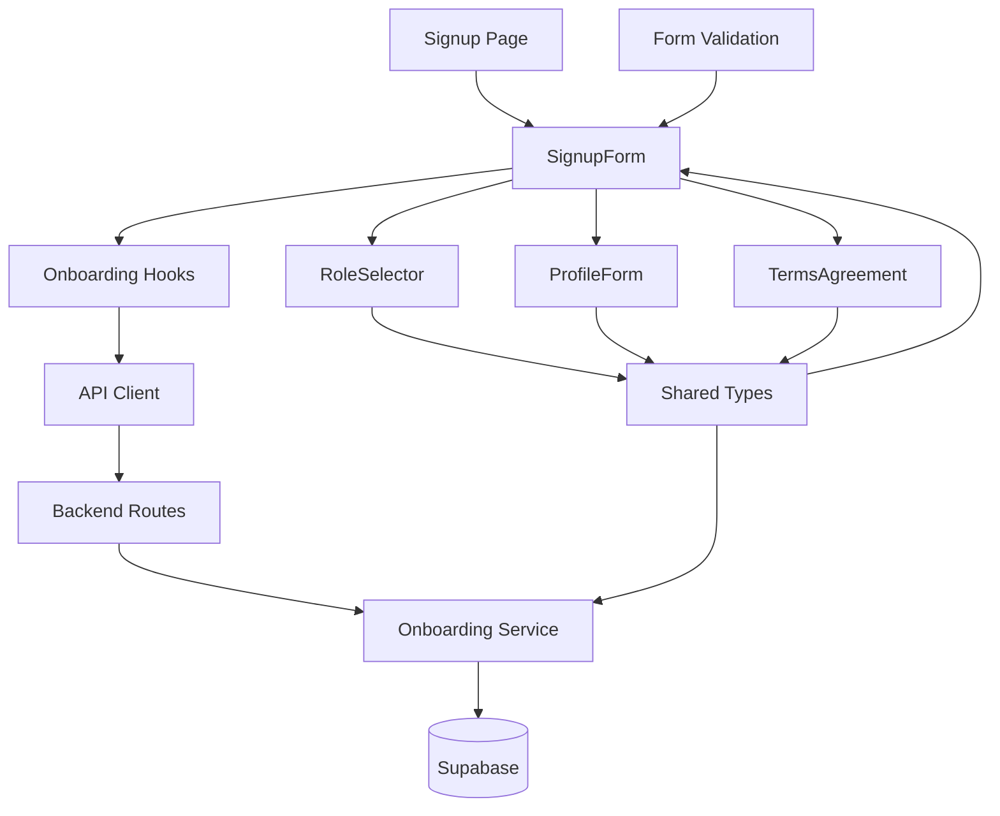

# Use Case 001: 역할 선택 & 온보딩 - 모듈화 설계

## 개요

### 주요 모듈 목록

| 모듈명 | 위치 | 설명 |
|--------|------|------|
| `auth/onboarding` | `src/features/auth/` | 온보딩 프로세스 전체를 관리하는 feature 모듈 |
| `auth/signup` | `src/features/auth/components/signup-form.tsx` | 확장된 회원가입 폼 컴포넌트 |
| `auth/role-selector` | `src/features/auth/components/role-selector.tsx` | 역할 선택 UI 컴포넌트 |
| `auth/profile-form` | `src/features/auth/components/profile-form.tsx` | 프로필 정보 입력 폼 |
| `auth/terms-agreement` | `src/features/auth/components/terms-agreement.tsx` | 약관 동의 UI 컴포넌트 |
| `auth/onboarding-backend` | `src/features/auth/backend/onboarding/` | 백엔드 API 및 서비스 로직 |
| `auth/onboarding-hooks` | `src/features/auth/hooks/` | React Query hooks for API calls |
| `shared/user-types` | `src/lib/shared/user-types.ts` | 공통 사용자 관련 타입 정의 |
| `shared/form-validation` | `src/lib/shared/form-validation.ts` | 공통 폼 검증 스키마 |

## Diagram

## Implementation Plan

### 1. Shared Modules (공통 모듈)

#### `src/lib/shared/user-types.ts`
- **목적**: 사용자 역할 및 프로필 관련 타입 정의
- **내용**:
  - `UserRole` enum 타입 ('learner', 'instructor')
  - `ProfileFormData` 인터페이스 (이름, 휴대폰번호)
  - `OnboardingData` 인터페이스 (역할 + 프로필 + 약관 동의)
- **단위 테스트**: 타입 정의 검증 및 enum 값 테스트

#### `src/lib/shared/form-validation.ts`
- **목적**: 공통 폼 검증 스키마 정의 (Zod 사용)
- **내용**:
  - `roleSchema`: 역할 선택 검증
  - `profileSchema`: 프로필 정보 검증
  - `onboardingSchema`: 전체 온보딩 데이터 검증
- **단위 테스트**: 각 스키마의 유효성 검증 테스트

### 2. Backend Modules

#### `src/features/auth/backend/onboarding/schema.ts`
- **목적**: API 요청/응답 스키마 정의
- **내용**:
  - `OnboardingRequestSchema`: 클라이언트 요청 검증
  - `OnboardingResponseSchema`: API 응답 스키마
  - 데이터베이스 테이블 스키마 (profiles, terms_agreements)
- **단위 테스트**: 스키마 검증 및 변환 테스트

#### `src/features/auth/backend/onboarding/service.ts`
- **목적**: 비즈니스 로직 구현
- **내용**:
  - `createProfile()`: 사용자 프로필 생성
  - `recordTermsAgreement()`: 약관 동의 기록
  - 트랜잭션 처리 및 에러 핸들링
- **단위 테스트**: 각 서비스 함수의 성공/실패 케이스 테스트

#### `src/features/auth/backend/onboarding/route.ts`
- **목적**: Hono 라우트 정의
- **내용**:
  - `POST /api/auth/onboarding`: 온보딩 API 엔드포인트
  - 요청 검증 및 응답 처리
- **QA 시트**: API 엔드포인트 테스트 케이스 (정상 케이스, 유효성 검증 실패, 중복 처리 등)

#### `src/features/auth/backend/onboarding/error.ts`
- **목적**: 에러 코드 및 타입 정의
- **내용**: 서비스별 에러 코드 정의

### 3. Frontend Components

#### `src/features/auth/components/role-selector.tsx`
- **목적**: 역할 선택 UI 컴포넌트
- **내용**:
  - Learner/Instructor 선택 라디오 버튼
  - 선택 상태 관리
  - 접근성 고려 (ARIA 속성)
- **QA 시트**: 컴포넌트 인터랙션 테스트 (선택, 해제, 키보드 네비게이션)

#### `src/features/auth/components/profile-form.tsx`
- **목적**: 프로필 정보 입력 폼
- **내용**:
  - 이름 입력 필드 (필수)
  - 휴대폰번호 입력 필드 (선택)
  - 실시간 유효성 검증
- **QA 시트**: 폼 유효성 테스트 (필수 필드 검증, 포맷 검증)

#### `src/features/auth/components/terms-agreement.tsx`
- **목적**: 약관 동의 UI 컴포넌트
- **내용**:
  - 약관 내용 표시
  - 동의 체크박스
  - 필수 동의 검증
- **QA 시트**: 동의 상태 테스트 (체크/언체크, 필수 검증)

#### `src/features/auth/components/signup-form.tsx` (기존 확장)
- **목적**: 통합된 회원가입 폼
- **내용**:
  - 기존 이메일/비밀번호 필드 유지
  - 역할 선택, 프로필 입력, 약관 동의 컴포넌트 통합
  - 단계별 진행 상태 관리
- **QA 시트**: 전체 플로우 테스트 (단계별 진행, 유효성 검증, 제출)

### 4. Frontend Hooks

#### `src/features/auth/hooks/useOnboarding.ts`
- **목적**: 온보딩 API 호출을 위한 React Query hook
- **내용**:
  - `useOnboardingMutation`: 온보딩 데이터 제출
  - 성공/실패 처리 로직
- **단위 테스트**: API 호출 성공/실패 시나리오 테스트

### 5. Page Integration

#### `src/app/signup/page.tsx` (기존 수정)
- **목적**: 확장된 회원가입 페이지
- **내용**:
  - 기존 로직 유지하면서 온보딩 컴포넌트 통합
  - 역할 기반 리다이렉트 로직 추가
- **QA 시트**: E2E 플로우 테스트 (회원가입 → 온보딩 → 리다이렉트)

### 6. Database Migration

#### `supabase/migrations/`
- **목적**: 필요한 데이터베이스 스키마 생성
- **내용**: profiles, terms_agreements 테이블 생성 마이그레이션
- **단위 테스트**: 마이그레이션 실행 후 스키마 검증

### 구현 순서
1. Shared 모듈 구현 (타입, 검증 스키마)
2. Backend API 및 서비스 구현
3. Frontend 컴포넌트 구현 (하위 → 상위)
4. Hook 및 페이지 통합
5. QA 및 테스트 진행
