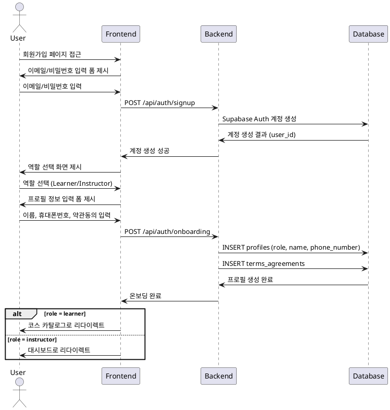

# Use Case 001: 역할 선택 & 온보딩

## Primary Actor
신규 사용자 (미가입자)

## Precondition
- 사용자가 LMS 서비스에 처음 접근
- 유효한 이메일 주소 보유

## Trigger
사용자가 회원가입 페이지에 접근하여 계정 생성을 시작

## Main Scenario
1. 사용자가 이메일/비밀번호를 입력하여 계정 생성
2. 시스템이 역할 선택 화면(Learner/Instructor)을 제시
3. 사용자가 역할을 선택
4. 사용자가 프로필 정보(이름, 휴대폰번호) 입력
5. 사용자가 약관에 동의
6. 시스템이 계정을 생성하고 프로필 정보를 저장
7. 시스템이 약관 동의 이력을 기록
8. 역할에 따른 초기 페이지로 리다이렉트
   - Learner: 코스 카탈로그
   - Instructor: 대시보드

## Edge Cases
- **이메일 중복**: 이미 존재하는 이메일로 가입 시도 시 오류 메시지 표시
- **약관 미동의**: 약관 동의 없이 진행 시 가입 차단
- **필수 정보 누락**: 이름 미입력 시 가입 진행 불가
- **네트워크 오류**: 가입 과정 중 연결 끊김 시 재시도 안내

## Business Rules
- 이메일은 중복될 수 없음
- 역할은 가입 시점에 선택되며 추후 변경 불가
- 휴대폰번호는 선택사항
- 약관 동의는 필수
- 가입 완료 후 즉시 로그인 상태가 됨

## Sequence Diagram

