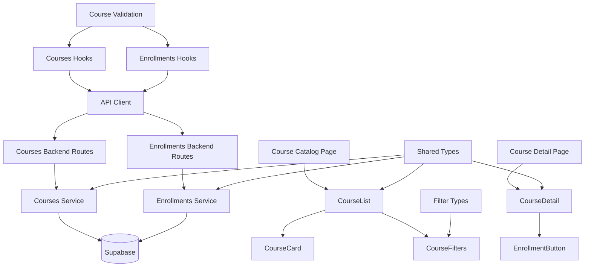

# Use Case 002: 코스 탐색 & 수강신청/취소 (Learner) - 모듈화 설계

## 개요

### 주요 모듈 목록

| 모듈명 | 위치 | 설명 |
|--------|------|------|
| `courses` | `src/features/courses/` | 코스 조회 및 관리를 위한 feature 모듈 |
| `enrollments` | `src/features/enrollments/` | 수강신청 및 관리를 위한 feature 모듈 |
| `courses/course-list` | `src/features/courses/components/course-list.tsx` | 코스 목록 표시 컴포넌트 |
| `courses/course-card` | `src/features/courses/components/course-card.tsx` | 개별 코스 카드 컴포넌트 |
| `courses/course-filters` | `src/features/courses/components/course-filters.tsx` | 검색/필터 UI 컴포넌트 |
| `courses/course-detail` | `src/features/courses/components/course-detail.tsx` | 코스 상세 정보 컴포넌트 |
| `enrollments/enrollment-button` | `src/features/enrollments/components/enrollment-button.tsx` | 수강신청/취소 버튼 컴포넌트 |
| `courses-backend` | `src/features/courses/backend/` | 코스 관련 API 및 서비스 로직 |
| `enrollments-backend` | `src/features/enrollments/backend/` | 수강신청 관련 API 및 서비스 로직 |
| `courses-hooks` | `src/features/courses/hooks/` | 코스 조회를 위한 React Query hooks |
| `enrollments-hooks` | `src/features/enrollments/hooks/` | 수강신청을 위한 React Query hooks |
| `shared/course-types` | `src/lib/shared/course-types.ts` | 코스 관련 공통 타입 정의 |
| `shared/enrollment-types` | `src/lib/shared/enrollment-types.ts` | 수강신청 관련 공통 타입 정의 |
| `shared/filter-types` | `src/lib/shared/filter-types.ts` | 검색/필터 관련 공통 타입 |
| `shared/course-validation` | `src/lib/shared/course-validation.ts` | 코스 관련 공통 검증 스키마 |

## Diagram

## Implementation Plan

### 1. Shared Modules (공통 모듈)

#### `src/lib/shared/course-types.ts`
- **목적**: 코스 관련 공통 타입 정의
- **내용**:
  - `CourseStatus` enum ('draft', 'published', 'archived', 'closed')
  - `Course` 인터페이스 (id, title, description, status, instructor, category, difficulty 등)
  - `CourseSummary` 인터페이스 (목록 표시용 간략 정보)
  - `CourseDetail` 인터페이스 (상세 정보용)
- **단위 테스트**: 타입 정의 검증 및 인터페이스 호환성 테스트

#### `src/lib/shared/enrollment-types.ts`
- **목적**: 수강신청 관련 공통 타입 정의
- **내용**:
  - `Enrollment` 인터페이스 (id, user_id, course_id, enrolled_at)
  - `EnrollmentStatus` enum ('enrolled', 'cancelled')
- **단위 테스트**: 타입 정의 검증

#### `src/lib/shared/filter-types.ts`
- **목적**: 검색/필터 관련 공통 타입 정의
- **내용**:
  - `CourseFilters` 인터페이스 (category, difficulty, searchKeyword)
  - `SortOption` enum ('newest', 'popular')
  - `CourseListParams` 인터페이스 (필터 + 정렬 + 페이지네이션)
- **단위 테스트**: 필터 조합 및 파라미터 변환 테스트

#### `src/lib/shared/course-validation.ts`
- **목적**: 코스 관련 공통 검증 스키마 (Zod 사용)
- **내용**:
  - `courseIdSchema`: 코스 ID 검증
  - `courseFiltersSchema`: 검색/필터 파라미터 검증
  - `enrollmentRequestSchema`: 수강신청 요청 검증
- **단위 테스트**: 각 스키마의 유효성 검증 테스트

### 2. Courses Backend Modules

#### `src/features/courses/backend/schema.ts`
- **목적**: 코스 API 요청/응답 스키마 정의
- **내용**:
  - `CourseListRequestSchema`: 목록 조회 요청 검증
  - `CourseListResponseSchema`: 목록 응답 스키마
  - `CourseDetailResponseSchema`: 상세 조회 응답 스키마
  - 데이터베이스 테이블 스키마 (courses, categories, difficulties)
- **단위 테스트**: 스키마 검증 및 데이터 변환 테스트

#### `src/features/courses/backend/service.ts`
- **목적**: 코스 조회 비즈니스 로직
- **내용**:
  - `getCourses()`: 필터링된 코스 목록 조회 (status='published'만)
  - `getCourseById()`: 코스 상세 정보 조회
  - `getCategories()`: 카테고리 목록 조회
  - `getDifficulties()`: 난이도 목록 조회
- **단위 테스트**: 각 서비스 함수의 쿼리 결과 검증 및 필터링 로직 테스트

#### `src/features/courses/backend/route.ts`
- **목적**: 코스 관련 Hono 라우트 정의
- **내용**:
  - `GET /api/courses`: 코스 목록 조회 (필터/정렬 지원)
  - `GET /api/courses/:courseId`: 코스 상세 조회
  - `GET /api/categories`: 카테고리 목록
  - `GET /api/difficulties`: 난이도 목록
- **QA 시트**: API 엔드포인트 테스트 케이스 (필터링, 정렬, 페이징, 에러 처리)

#### `src/features/courses/backend/error.ts`
- **목적**: 코스 서비스 에러 코드 정의
- **내용**: 코스 조회 관련 에러 코드 및 메시지

### 3. Enrollments Backend Modules

#### `src/features/enrollments/backend/schema.ts`
- **목적**: 수강신청 API 요청/응답 스키마 정의
- **내용**:
  - `EnrollmentRequestSchema`: 수강신청 요청 검증
  - `EnrollmentResponseSchema`: 수강신청 응답 스키마
  - `EnrollmentCancelRequestSchema`: 수강취소 요청 검증
  - 데이터베이스 테이블 스키마 (enrollments)
- **단위 테스트**: 스키마 검증 및 데이터 변환 테스트

#### `src/features/enrollments/backend/service.ts`
- **목적**: 수강신청 비즈니스 로직
- **내용**:
  - `createEnrollment()`: 수강신청 (중복 체크 포함)
  - `cancelEnrollment()`: 수강취소
  - `checkEnrollmentStatus()`: 수강신청 상태 확인
- **단위 테스트**: 중복 신청 방지 로직 및 트랜잭션 처리 테스트

#### `src/features/enrollments/backend/route.ts`
- **목적**: 수강신청 관련 Hono 라우트 정의
- **내용**:
  - `POST /api/enrollments`: 수강신청
  - `DELETE /api/enrollments/:courseId`: 수강취소
  - `GET /api/enrollments/:courseId`: 수강신청 상태 확인
- **QA 시트**: API 엔드포인트 테스트 케이스 (중복 신청, 권한 검증, 에러 처리)

#### `src/features/enrollments/backend/error.ts`
- **목적**: 수강신청 서비스 에러 코드 정의
- **내용**: 수강신청 관련 에러 코드 (중복 신청, 권한 없음 등)

### 4. Frontend Components

#### `src/features/courses/components/course-list.tsx`
- **목적**: 코스 목록 표시 및 필터링 UI
- **내용**:
  - 코스 카드 목록 렌더링
  - 무한 스크롤 또는 페이지네이션
  - 로딩 및 빈 상태 처리
- **QA 시트**: 목록 표시 테스트 (필터링 결과, 정렬, 로딩 상태)

#### `src/features/courses/components/course-card.tsx`
- **목적**: 개별 코스 정보 카드
- **내용**:
  - 코스 기본 정보 표시 (제목, 설명, 카테고리, 난이도)
  - 수강신청 상태 표시
  - 상세 페이지로의 링크
- **QA 시트**: 카드 표시 테스트 (데이터 바인딩, 링크 동작)

#### `src/features/courses/components/course-filters.tsx`
- **목적**: 검색/필터 UI 컴포넌트
- **내용**:
  - 검색어 입력 필드
  - 카테고리/난이도 드롭다운
  - 정렬 옵션 (최신순/인기순)
  - 필터 적용/초기화 버튼
- **QA 시트**: 필터 인터랙션 테스트 (입력, 선택, 적용, 초기화)

#### `src/features/courses/components/course-detail.tsx`
- **목적**: 코스 상세 정보 표시
- **내용**:
  - 코스 상세 정보 표시 (커리큘럼, 강사 정보 등)
  - 수강신청 버튼 통합
  - 관련 코스 추천 (옵션)
- **QA 시트**: 상세 정보 표시 테스트 (데이터 로딩, 수강신청 연동)

#### `src/features/enrollments/components/enrollment-button.tsx`
- **목적**: 수강신청/취소 버튼 컴포넌트
- **내용**:
  - 현재 수강 상태에 따른 버튼 텍스트/스타일 변경
  - 신청/취소 액션 처리
  - 로딩 상태 및 에러 처리
- **QA 시트**: 버튼 상태 테스트 (신청 전/후, 로딩 중, 에러 상태)

### 5. Frontend Hooks

#### `src/features/courses/hooks/useCourses.ts`
- **목적**: 코스 목록 조회를 위한 React Query hooks
- **내용**:
  - `useCoursesQuery`: 필터링된 코스 목록 조회
  - `useCourseQuery`: 개별 코스 상세 조회
  - `useCategoriesQuery`: 카테고리 목록 조회
  - `useDifficultiesQuery`: 난이도 목록 조회
- **단위 테스트**: 쿼리 상태 및 데이터 변환 테스트

#### `src/features/enrollments/hooks/useEnrollments.ts`
- **목적**: 수강신청을 위한 React Query hooks
- **내용**:
  - `useCreateEnrollmentMutation`: 수강신청 뮤테이션
  - `useCancelEnrollmentMutation`: 수강취소 뮤테이션
  - `useEnrollmentStatusQuery`: 수강신청 상태 조회
- **단위 테스트**: 뮤테이션 성공/실패 시나리오 테스트

### 6. Page Integration

#### `src/app/courses/page.tsx` (신규)
- **목적**: 코스 카탈로그 페이지
- **내용**:
  - CourseList 컴포넌트 통합
  - 필터 상태 관리
  - 페이지네이션 처리
- **QA 시트**: E2E 플로우 테스트 (목록 조회, 필터링, 상세 페이지 이동)

#### `src/app/courses/[courseId]/page.tsx` (신규)
- **목적**: 코스 상세 페이지
- **내용**:
  - CourseDetail 컴포넌트 통합
  - EnrollmentButton 컴포넌트 통합
- **QA 시트**: E2E 플로우 테스트 (상세 조회, 수강신청/취소)

### 7. Database Migration

#### `supabase/migrations/0003_create_core_tables.sql`
- **목적**: 코스 관련 테이블 생성
- **내용**: courses, enrollments, categories, difficulties 테이블 생성
- **단위 테스트**: 마이그레이션 실행 후 스키마 검증

### 구현 순서
1. Shared 모듈 및 데이터베이스 마이그레이션
2. Backend API 및 서비스 구현 (courses → enrollments)
3. Frontend 컴포넌트 구현 (하위 → 상위)
4. Hooks 및 페이지 통합
5. QA 및 테스트 진행
