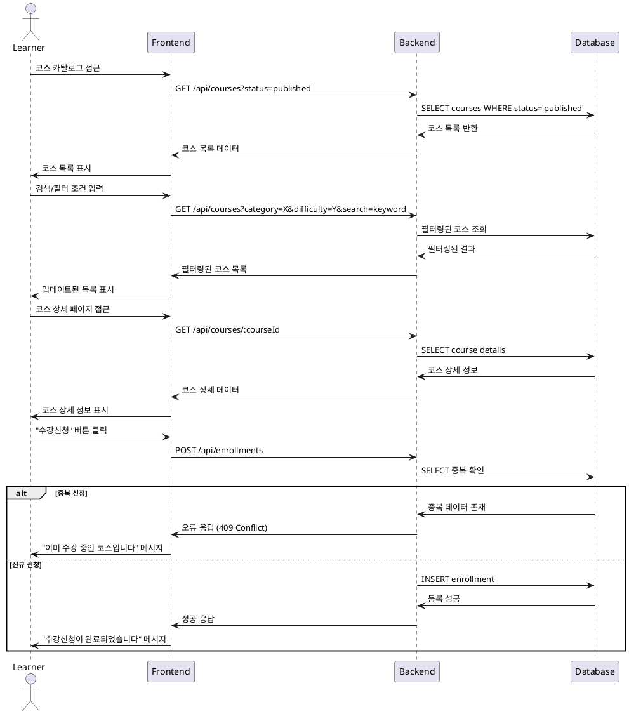

# Use Case 002: 코스 탐색 & 수강신청/취소 (Learner)

## Primary Actor
학습자 (Learner)

## Precondition
- 사용자가 Learner 역할로 로그인된 상태
- 시스템에 게시된 코스가 존재

## Trigger
학습자가 코스 카탈로그 페이지에 접근

## Main Scenario
1. 학습자가 코스 목록 페이지에 접근
2. 시스템이 게시된 코스 목록을 표시 (status='published'만)
3. 학습자가 검색어 입력 또는 필터(카테고리, 난이도) 적용
4. 학습자가 정렬 옵션(최신순/인기순) 선택
5. 시스템이 필터링된 코스 목록을 표시
6. 학습자가 관심 있는 코스를 선택하여 상세 페이지로 이동
7. 학습자가 "수강신청" 버튼 클릭
8. 시스템이 수강신청 자격을 검증
9. 시스템이 enrollments 테이블에 등록 정보를 저장
10. 시스템이 성공 메시지를 표시하고 학습자 대시보드를 업데이트

## Edge Cases
- **중복 신청**: 이미 수강 중인 코스 재신청 시 오류 메시지 표시
- **비공개 코스 접근**: draft/archived 상태 코스 접근 시 차단
- **수강취소**: 수강 중인 코스에서 "수강취소" 선택 시 enrollments에서 삭제
- **검색 결과 없음**: 검색 조건에 맞는 코스가 없을 때 안내 메시지 표시

## Business Rules
- status='published' 상태의 코스만 수강신청 가능
- 한 코스당 한 번의 수강신청만 허용 (UNIQUE 제약)
- 수강취소 시 해당 코스의 모든 성적 데이터는 대시보드에서 제외
- 삭제된 코스는 목록에서 표시되지 않음

## Sequence Diagram

