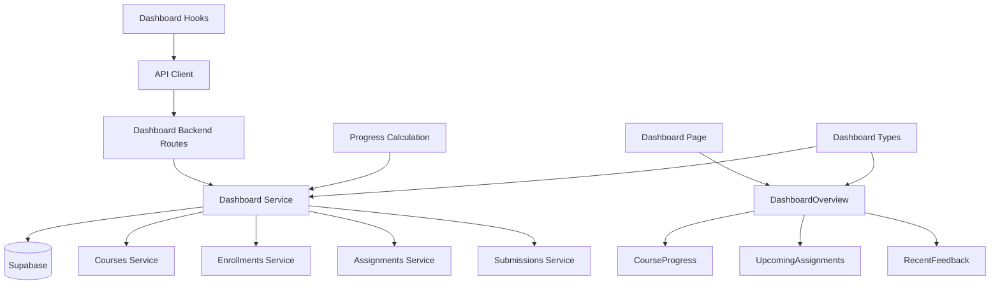

# Use Case 003: Learner 대시보드 - 모듈화 설계

## 개요

### 주요 모듈 목록

| 모듈명 | 위치 | 설명 |
|--------|------|------|
| `dashboard` | `src/features/dashboard/` | Learner 대시보드 전체를 관리하는 feature 모듈 |
| `dashboard/dashboard-overview` | `src/features/dashboard/components/dashboard-overview.tsx` | 대시보드 메인 컴포넌트 |
| `dashboard/course-progress` | `src/features/dashboard/components/course-progress.tsx` | 코스별 진행률 표시 컴포넌트 |
| `dashboard/upcoming-assignments` | `src/features/dashboard/components/upcoming-assignments.tsx` | 마감 임박 과제 목록 컴포넌트 |
| `dashboard/recent-feedback` | `src/features/dashboard/components/recent-feedback.tsx` | 최근 피드백 요약 컴포넌트 |
| `dashboard-backend` | `src/features/dashboard/backend/` | 대시보드 데이터 집계를 위한 API 및 서비스 로직 |
| `dashboard-hooks` | `src/features/dashboard/hooks/` | 대시보드 데이터 조회를 위한 React Query hooks |
| `shared/dashboard-types` | `src/lib/shared/dashboard-types.ts` | 대시보드 관련 공통 타입 정의 |
| `shared/progress-calculation` | `src/lib/shared/progress-calculation.ts` | 진행률 계산 공통 로직 |

## Diagram

## Implementation Plan

### 1. Shared Modules (공통 모듈)

#### `src/lib/shared/dashboard-types.ts`
- **목적**: 대시보드 관련 공통 타입 정의
- **내용**:
  - `CourseProgress` 인터페이스 (courseId, courseTitle, progressPercentage, completedAssignments, totalAssignments)
  - `UpcomingAssignment` 인터페이스 (assignmentId, courseTitle, title, dueDate, daysLeft)
  - `RecentFeedback` 인터페이스 (submissionId, assignmentTitle, courseTitle, score, feedback, gradedAt)
  - `LearnerDashboard` 인터페이스 (courses, progress, upcomingAssignments, recentFeedback)
- **단위 테스트**: 타입 정의 검증 및 인터페이스 호환성 테스트

#### `src/lib/shared/progress-calculation.ts`
- **목적**: 코스 진행률 계산 공통 로직
- **내용**:
  - `calculateProgress()`: 코스별 진행률 계산 함수 (graded/total assignments)
  - `isUpcomingAssignment()`: 마감 임박 과제 판별 함수 (3일 이내)
  - `isRecentFeedback()`: 최근 피드백 판별 함수 (7일 이내 graded)
- **단위 테스트**: 계산 로직 검증 (진행률 계산, 날짜 비교 로직)

### 2. Dashboard Backend Modules

#### `src/features/dashboard/backend/schema.ts`
- **목적**: 대시보드 API 요청/응답 스키마 정의
- **내용**:
  - `DashboardResponseSchema`: 대시보드 데이터 응답 스키마
  - `CourseProgressSchema`: 코스 진행률 스키마
  - `UpcomingAssignmentSchema`: 마감 임박 과제 스키마
  - `RecentFeedbackSchema`: 최근 피드백 스키마
- **단위 테스트**: 스키마 검증 및 데이터 변환 테스트

#### `src/features/dashboard/backend/service.ts`
- **목적**: 대시보드 데이터 집계 비즈니스 로직
- **내용**:
  - `getLearnerDashboard()`: 학습자 대시보드 데이터 전체 조회 및 집계
  - `getEnrolledCourses()`: 수강 중인 코스 목록 조회
  - `calculateCoursesProgress()`: 각 코스별 진행률 계산
  - `getUpcomingAssignments()`: 마감 임박 과제 조회 (3일 이내)
  - `getRecentFeedback()`: 최근 피드백 조회 (7일 이내 graded)
- **단위 테스트**: 데이터 집계 로직 테스트 (진행률 계산, 필터링, 정렬)

#### `src/features/dashboard/backend/route.ts`
- **목적**: 대시보드 관련 Hono 라우트 정의
- **내용**:
  - `GET /api/learner/dashboard`: 학습자 대시보드 데이터 조회
- **QA 시트**: API 엔드포인트 테스트 케이스 (정상 응답, 빈 데이터, 권한 검증)

#### `src/features/dashboard/backend/error.ts`
- **목적**: 대시보드 서비스 에러 코드 정의
- **내용**: 대시보드 조회 관련 에러 코드 및 메시지

### 3. Frontend Components

#### `src/features/dashboard/components/dashboard-overview.tsx`
- **목적**: 대시보드 메인 컴포넌트 및 레이아웃
- **내용**:
  - 대시보드 데이터 상태 관리
  - 하위 컴포넌트 통합 (진행률, 마감 임박, 피드백)
  - 로딩 및 에러 상태 처리
  - 빈 상태 처리 (수강 코스 없음 등)
- **QA 시트**: 대시보드 레이아웃 테스트 (컴포넌트 통합, 상태 표시)

#### `src/features/dashboard/components/course-progress.tsx`
- **목적**: 수강 코스 목록 및 진행률 표시
- **내용**:
  - 코스별 진행률 바 차트
  - 코스 제목 및 기본 정보 표시
  - 진행률 텍스트 (예: "3/5 완료")
  - 코스 상세 페이지 링크
- **QA 시트**: 진행률 표시 테스트 (데이터 바인딩, 차트 렌더링, 링크 동작)

#### `src/features/dashboard/components/upcoming-assignments.tsx`
- **목적**: 마감 임박 과제 목록 표시
- **내용**:
  - 마감일 기준 정렬 (가까운 순서)
  - D-day 표시 (예: "D-2", "D-1")
  - 과제 제목, 코스명, 마감일 표시
  - 빈 상태 처리 ("마감 임박 과제 없음")
- **QA 시트**: 과제 목록 테스트 (정렬, 날짜 표시, 빈 상태)

#### `src/features/dashboard/components/recent-feedback.tsx`
- **목적**: 최근 피드백 요약 표시
- **내용**:
  - 채점일 기준 정렬 (최신순)
  - 과제명, 코스명, 점수, 피드백 요약 표시
  - 채점일 표시 (예: "3일 전")
  - 빈 상태 처리 ("최근 피드백 없음")
- **QA 시트**: 피드백 목록 테스트 (정렬, 요약 표시, 빈 상태)

### 4. Frontend Hooks

#### `src/features/dashboard/hooks/useLearnerDashboard.ts`
- **목적**: 대시보드 데이터 조회를 위한 React Query hook
- **내용**:
  - `useLearnerDashboardQuery`: 학습자 대시보드 데이터 조회
  - 캐싱 및 리패칭 로직
  - 에러 처리 및 로딩 상태
- **단위 테스트**: 쿼리 상태 및 데이터 변환 테스트

### 5. Page Integration

#### `src/app/(protected)/dashboard/page.tsx` (기존 수정)
- **목적**: 대시보드 페이지 구현
- **내용**:
  - DashboardOverview 컴포넌트 통합
  - 기존 기본 UI 교체
  - 역할별 대시보드 분기 (Learner 전용)
- **QA 시트**: E2E 플로우 테스트 (데이터 로딩, 컴포넌트 표시, 에러 처리)

### 6. Supporting Backend Dependencies

#### `src/features/courses/backend/service.ts` (확장)
- **목적**: 대시보드에서 필요한 코스 조회 기능 추가
- **내용**:
  - `getCoursesByLearner()`: 특정 학습자의 수강 코스 조회
- **단위 테스트**: 학습자별 코스 조회 테스트

#### `src/features/assignments/backend/service.ts` (신규)
- **목적**: 과제 관련 조회 기능
- **내용**:
  - `getAssignmentsByCourses()`: 여러 코스의 과제 목록 조회
  - `getUpcomingAssignmentsByLearner()`: 학습자의 마감 임박 과제 조회
- **단위 테스트**: 과제 조회 및 필터링 테스트

#### `src/features/submissions/backend/service.ts` (신규)
- **목적**: 제출물 관련 조회 기능
- **내용**:
  - `getSubmissionsByLearner()`: 학습자의 제출물 목록 조회
  - `getRecentFeedbackByLearner()`: 학습자의 최근 피드백 조회
- **단위 테스트**: 제출물 조회 및 피드백 필터링 테스트

### 구현 순서
1. Shared 모듈 및 공통 로직 구현 (타입, 계산 함수)
2. Supporting backend 모듈 구현 (assignments, submissions)
3. Dashboard backend API 및 서비스 구현
4. Frontend 컴포넌트 구현 (하위 → 상위)
5. Hooks 및 페이지 통합
6. QA 및 테스트 진행
