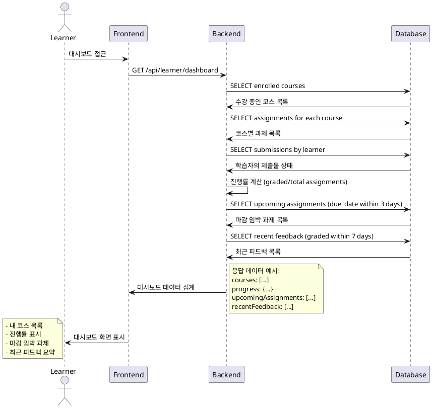

# Use Case 003: Learner 대시보드

## Primary Actor
학습자 (Learner)

## Precondition
- 사용자가 Learner 역할로 로그인된 상태
- 사용자가 최소 1개 이상의 코스에 수강신청한 상태

## Trigger
학습자가 대시보드 페이지에 접근

## Main Scenario
1. 학습자가 대시보드에 접근
2. 시스템이 학습자의 수강 코스 목록을 조회
3. 시스템이 각 코스별 진행률을 계산 (완료 과제 수 / 전체 과제 수)
4. 시스템이 마감 임박 과제를 식별 (마감일 기준 3일 이내)
5. 시스템이 최근 피드백을 조회 (최근 7일 이내 graded 상태 변경)
6. 시스템이 대시보드 정보를 표시:
   - 내 코스 목록
   - 각 코스별 진행률
   - 마감 임박 과제 리스트
   - 최근 피드백 요약

## Edge Cases
- **수강 코스 없음**: 수강신청한 코스가 없을 때 수강신청 안내 메시지 표시
- **과제 없음**: 수강 중인 코스에 게시된 과제가 없을 때 "과제 없음" 표시
- **피드백 없음**: 최근 피드백이 없을 때 빈 상태 메시지 표시
- **마감 임박 과제 없음**: 마감 임박 과제가 없을 때 "마감 임박 과제 없음" 표시

## Business Rules
- 진행률 = (graded 상태 과제 수) / (published 상태 과제 수) × 100
- 마감 임박 기준: 현재 시점에서 3일 이내 마감
- 최근 피드백 기준: 7일 이내 status가 'graded'로 변경된 제출물
- 삭제되거나 archived 상태의 코스는 표시하지 않음

## Sequence Diagram

