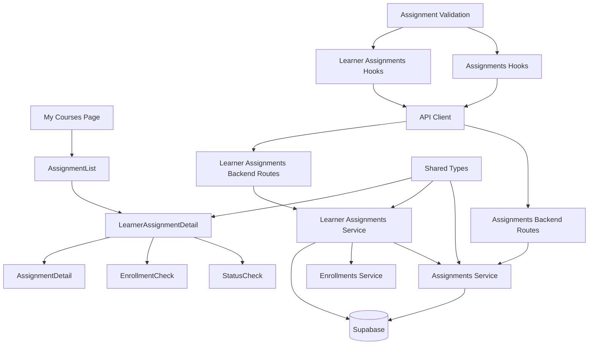

# Use Case 004: 과제 상세 열람 (Learner) - 모듈화 설계

## 개요

### 주요 모듈 목록

| 모듈명 | 위치 | 설명 |
|--------|------|------|
| `assignments` | `src/features/assignments/` | 과제 관리를 위한 feature 모듈 |
| `learner-assignments` | `src/features/learner-assignments/` | 학습자 관점의 과제 열람을 위한 feature 모듈 |
| `assignments/assignment-list` | `src/features/assignments/components/assignment-list.tsx` | 과제 목록 표시 컴포넌트 |
| `assignments/assignment-detail` | `src/features/assignments/components/assignment-detail.tsx` | 과제 상세 정보 컴포넌트 |
| `learner-assignments/learner-assignment-detail` | `src/features/learner-assignments/components/learner-assignment-detail.tsx` | 학습자용 과제 상세 컴포넌트 (권한 검증 포함) |
| `assignments-backend` | `src/features/assignments/backend/` | 과제 관련 API 및 서비스 로직 |
| `learner-assignments-backend` | `src/features/learner-assignments/backend/` | 학습자용 과제 API 및 권한 검증 로직 |
| `assignments-hooks` | `src/features/assignments/hooks/` | 과제 조회를 위한 React Query hooks |
| `learner-assignments-hooks` | `src/features/learner-assignments/hooks/` | 학습자용 과제 조회 hooks |
| `shared/assignment-types` | `src/lib/shared/assignment-types.ts` | 과제 관련 공통 타입 정의 |
| `shared/assignment-validation` | `src/lib/shared/assignment-validation.ts` | 과제 관련 공통 검증 스키마 |

## Diagram

## Implementation Plan

### 1. Shared Modules (공통 모듈)

#### `src/lib/shared/assignment-types.ts`
- **목적**: 과제 관련 공통 타입 정의
- **내용**:
  - `AssignmentStatus` enum ('draft', 'published', 'closed')
  - `Assignment` 인터페이스 (id, courseId, title, description, dueDate, scoreWeighting, allowLateSubmission, allowResubmission, status 등)
  - `AssignmentSummary` 인터페이스 (목록 표시용 간략 정보)
  - `AssignmentDetail` 인터페이스 (상세 정보용)
- **단위 테스트**: 타입 정의 검증 및 인터페이스 호환성 테스트

#### `src/lib/shared/assignment-validation.ts`
- **목적**: 과제 관련 공통 검증 스키마 (Zod 사용)
- **내용**:
  - `assignmentIdSchema`: 과제 ID 검증
  - `assignmentStatusSchema`: 과제 상태 검증
  - `assignmentQuerySchema`: 과제 조회 파라미터 검증
- **단위 테스트**: 각 스키마의 유효성 검증 테스트

### 2. Assignments Backend Modules

#### `src/features/assignments/backend/schema.ts`
- **목적**: 과제 API 요청/응답 스키마 정의
- **내용**:
  - `AssignmentListRequestSchema`: 목록 조회 요청 검증
  - `AssignmentListResponseSchema`: 목록 응답 스키마
  - `AssignmentDetailResponseSchema`: 상세 조회 응답 스키마
  - 데이터베이스 테이블 스키마 (assignments)
- **단위 테스트**: 스키마 검증 및 데이터 변환 테스트

#### `src/features/assignments/backend/service.ts`
- **목적**: 과제 조회 비즈니스 로직
- **내용**:
  - `getAssignmentsByCourse()`: 코스별 과제 목록 조회
  - `getAssignmentById()`: 개별 과제 상세 조회
  - `getPublishedAssignmentsByCourse()`: 코스별 published 상태 과제 조회
- **단위 테스트**: 각 서비스 함수의 쿼리 결과 검증 및 상태 필터링 테스트

#### `src/features/assignments/backend/route.ts`
- **목적**: 과제 관련 Hono 라우트 정의
- **내용**:
  - `GET /api/courses/:courseId/assignments`: 코스별 과제 목록 조회
  - `GET /api/assignments/:assignmentId`: 개별 과제 상세 조회
- **QA 시트**: API 엔드포인트 테스트 케이스 (권한 검증, 상태 필터링, 에러 처리)

#### `src/features/assignments/backend/error.ts`
- **목적**: 과제 서비스 에러 코드 정의
- **내용**: 과제 조회 관련 에러 코드 및 메시지

### 3. Learner Assignments Backend Modules

#### `src/features/learner-assignments/backend/schema.ts`
- **목적**: 학습자용 과제 API 요청/응답 스키마 정의
- **내용**:
  - `LearnerAssignmentListResponseSchema`: 학습자용 과제 목록 응답
  - `LearnerAssignmentDetailResponseSchema`: 학습자용 과제 상세 응답
- **단위 테스트**: 스키마 검증 및 데이터 변환 테스트

#### `src/features/learner-assignments/backend/service.ts`
- **목적**: 학습자용 과제 조회 및 권한 검증 로직
- **내용**:
  - `getLearnerAssignmentsByCourse()`: 수강신청한 코스의 과제 목록 조회 (권한 검증 포함)
  - `getLearnerAssignmentDetail()`: 개별 과제 상세 조회 (수강신청 및 상태 검증 포함)
  - `verifyLearnerAccess()`: 학습자의 과제 접근 권한 검증
- **단위 테스트**: 권한 검증 로직 테스트 (수강신청 확인, 상태 검증, 에러 처리)

#### `src/features/learner-assignments/backend/route.ts`
- **목적**: 학습자용 과제 관련 Hono 라우트 정의
- **내용**:
  - `GET /api/learner/courses/:courseId/assignments`: 학습자의 코스별 과제 목록
  - `GET /api/learner/assignments/:assignmentId`: 학습자의 과제 상세 조회
- **QA 시트**: API 엔드포인트 테스트 케이스 (권한 검증, 상태 필터링, 미수강자 접근 차단)

#### `src/features/learner-assignments/backend/error.ts`
- **목적**: 학습자 과제 서비스 에러 코드 정의
- **내용**: 권한 검증 관련 에러 코드 (403 Forbidden, 404 Not Found 등)

### 4. Frontend Components

#### `src/features/assignments/components/assignment-list.tsx`
- **목적**: 과제 목록 표시 컴포넌트
- **내용**:
  - 과제 카드 목록 렌더링
  - 마감일, 상태 표시
  - 과제 상세 페이지 링크
  - 빈 상태 처리
- **QA 시트**: 목록 표시 테스트 (데이터 바인딩, 링크 동작, 빈 상태)

#### `src/features/assignments/components/assignment-detail.tsx`
- **목적**: 과제 상세 정보 표시 (기본 컴포넌트)
- **내용**:
  - 과제 기본 정보 표시 (제목, 설명, 마감일, 점수 비중)
  - 정책 정보 표시 (지각 제출, 재제출 허용)
  - 상태 표시 (published/closed)
- **QA 시트**: 상세 정보 표시 테스트 (데이터 바인딩, 상태 표시)

#### `src/features/learner-assignments/components/learner-assignment-detail.tsx`
- **목적**: 학습자용 과제 상세 컴포넌트 (권한 검증 및 제출 UI 포함)
- **내용**:
  - AssignmentDetail 컴포넌트 활용
  - 수강신청 상태 검증
  - 과제 상태에 따른 제출 UI 제어
  - 제출 버튼 상태 관리 (활성/비활성)
  - 권한 없음/찾을 수 없음 에러 처리
- **QA 시트**: 권한 검증 테스트 (수강자/미수강자, 상태별 UI 제어)

### 5. Frontend Hooks

#### `src/features/assignments/hooks/useAssignments.ts`
- **목적**: 과제 조회를 위한 React Query hooks
- **내용**:
  - `useAssignmentsQuery`: 코스별 과제 목록 조회
  - `useAssignmentQuery`: 개별 과제 상세 조회
- **단위 테스트**: 쿼리 상태 및 데이터 변환 테스트

#### `src/features/learner-assignments/hooks/useLearnerAssignments.ts`
- **목적**: 학습자용 과제 조회를 위한 React Query hooks
- **내용**:
  - `useLearnerAssignmentsQuery`: 학습자의 코스별 과제 목록 조회
  - `useLearnerAssignmentQuery`: 학습자의 과제 상세 조회 (권한 검증 포함)
- **단위 테스트**: 권한 검증 및 쿼리 상태 테스트

### 6. Page Integration

#### `src/app/courses/[courseId]/assignments/page.tsx` (신규)
- **목적**: 코스별 과제 목록 페이지
- **내용**:
  - AssignmentList 컴포넌트 통합
  - 코스 정보 표시
- **QA 시트**: E2E 플로우 테스트 (목록 조회, 과제 선택)

#### `src/app/assignments/[assignmentId]/page.tsx` (신규)
- **목적**: 과제 상세 페이지 (일반용)
- **내용**:
  - AssignmentDetail 컴포넌트 통합
- **QA 시트**: E2E 플로우 테스트 (상세 조회)

#### `src/app/my/courses/[courseId]/assignments/[assignmentId]/page.tsx` (신규)
- **목적**: 학습자용 과제 상세 페이지
- **내용**:
  - LearnerAssignmentDetail 컴포넌트 통합
  - 권한 검증 및 제출 UI 포함
- **QA 시트**: E2E 플로우 테스트 (권한 검증, 제출 UI 상태)

### 구현 순서
1. Shared 모듈 구현 (타입, 검증 스키마)
2. Assignments backend 모듈 구현
3. Learner Assignments backend 모듈 구현 (권한 검증)
4. Frontend 컴포넌트 구현 (하위 → 상위)
5. Hooks 및 페이지 통합
6. QA 및 테스트 진행
