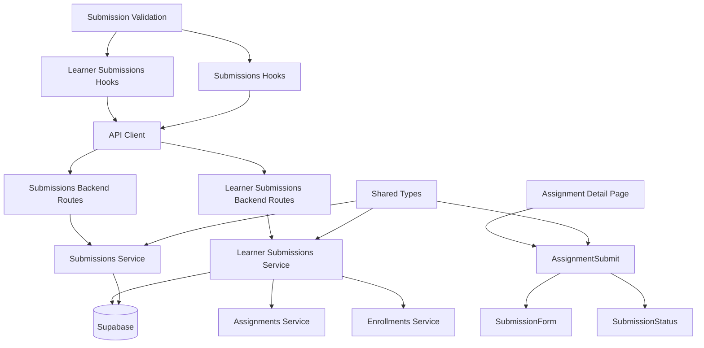

# Use Case 005: 과제 제출/재제출 (Learner) - 모듈화 설계

## 개요

### 주요 모듈 목록

| 모듈명 | 위치 | 설명 |
|--------|------|------|
| `submissions` | `src/features/submissions/` | 제출물 관리를 위한 feature 모듈 |
| `learner-submissions` | `src/features/learner-submissions/` | 학습자 관점의 과제 제출을 위한 feature 모듈 |
| `submissions/submission-form` | `src/features/submissions/components/submission-form.tsx` | 제출 폼 컴포넌트 |
| `submissions/submission-status` | `src/features/submissions/components/submission-status.tsx` | 제출 상태 표시 컴포넌트 |
| `learner-submissions/assignment-submit` | `src/features/learner-submissions/components/assignment-submit.tsx` | 학습자용 과제 제출 컴포넌트 |
| `submissions-backend` | `src/features/submissions/backend/` | 제출물 관련 API 및 서비스 로직 |
| `learner-submissions-backend` | `src/features/learner-submissions/backend/` | 학습자용 제출 API 및 검증 로직 |
| `submissions-hooks` | `src/features/submissions/hooks/` | 제출물 조회를 위한 React Query hooks |
| `learner-submissions-hooks` | `src/features/learner-submissions/hooks/` | 학습자용 제출을 위한 React Query hooks |
| `shared/submission-types` | `src/lib/shared/submission-types.ts` | 제출물 관련 공통 타입 정의 |
| `shared/submission-validation` | `src/lib/shared/submission-validation.ts` | 제출 관련 공통 검증 스키마 |

## Diagram

## Implementation Plan

### 1. Shared Modules (공통 모듈)

#### `src/lib/shared/submission-types.ts`
- **목적**: 제출물 관련 공통 타입 정의
- **내용**:
  - `SubmissionStatus` enum ('submitted', 'graded', 'resubmission_required')
  - `Submission` 인터페이스 (id, assignmentId, userId, contentText, contentLink, submittedAt, isLate, status, score, feedback)
  - `SubmissionFormData` 인터페이스 (contentText, contentLink)
  - `SubmissionResult` 인터페이스 (성공/실패 결과)
- **단위 테스트**: 타입 정의 검증 및 인터페이스 호환성 테스트

#### `src/lib/shared/submission-validation.ts`
- **목적**: 제출 관련 공통 검증 스키마 (Zod 사용)
- **내용**:
  - `submissionFormSchema`: 제출 폼 데이터 검증 (텍스트 필수, URL 유효성)
  - `submissionIdSchema`: 제출물 ID 검증
  - `submissionUpdateSchema`: 제출물 업데이트 검증
- **단위 테스트**: 각 스키마의 유효성 검증 테스트

### 2. Submissions Backend Modules

#### `src/features/submissions/backend/schema.ts`
- **목적**: 제출물 API 요청/응답 스키마 정의
- **내용**:
  - `SubmissionResponseSchema`: 제출물 응답 스키마
  - `SubmissionListResponseSchema`: 제출물 목록 응답 스키마
  - 데이터베이스 테이블 스키마 (submissions)
- **단위 테스트**: 스키마 검증 및 데이터 변환 테스트

#### `src/features/submissions/backend/service.ts`
- **목적**: 제출물 조회 및 관리 비즈니스 로직
- **내용**:
  - `getSubmissionById()`: 제출물 상세 조회
  - `getSubmissionsByAssignment()`: 과제별 제출물 목록 조회
  - `updateSubmission()`: 제출물 업데이트 (채점용)
- **단위 테스트**: 각 서비스 함수의 쿼리 결과 검증

#### `src/features/submissions/backend/route.ts`
- **목적**: 제출물 관련 Hono 라우트 정의
- **내용**:
  - `GET /api/submissions/:submissionId`: 제출물 상세 조회
  - `GET /api/assignments/:assignmentId/submissions`: 과제별 제출물 목록
  - `PUT /api/submissions/:submissionId`: 제출물 업데이트 (채점용)
- **QA 시트**: API 엔드포인트 테스트 케이스 (권한 검증, 데이터 검증, 에러 처리)

#### `src/features/submissions/backend/error.ts`
- **목적**: 제출물 서비스 에러 코드 정의
- **내용**: 제출물 조회/업데이트 관련 에러 코드 및 메시지

### 3. Learner Submissions Backend Modules

#### `src/features/learner-submissions/backend/schema.ts`
- **목적**: 학습자용 제출 API 요청/응답 스키마 정의
- **내용**:
  - `SubmissionRequestSchema`: 제출 요청 검증
  - `SubmissionResponseSchema`: 제출 응답 스키마
  - `LearnerSubmissionResponseSchema`: 학습자용 제출물 응답
- **단위 테스트**: 스키마 검증 및 데이터 변환 테스트

#### `src/features/learner-submissions/backend/service.ts`
- **목적**: 학습자용 제출 비즈니스 로직 및 검증
- **내용**:
  - `submitAssignment()`: 과제 제출/재제출 (모든 검증 포함)
  - `validateSubmissionRequest()`: 제출 요청 검증 (마감일, 정책, 중복 등)
  - `createOrUpdateSubmission()`: 제출물 생성 또는 업데이트
  - `checkSubmissionEligibility()`: 제출 자격 검증 (수강신청, 과제 상태, 정책)
- **단위 테스트**: 제출 검증 로직 테스트 (마감일 검증, 정책 확인, 중복 처리)

#### `src/features/learner-submissions/backend/route.ts`
- **목적**: 학습자용 제출 관련 Hono 라우트 정의
- **내용**:
  - `POST /api/assignments/:assignmentId/submit`: 과제 제출
  - `GET /api/assignments/:assignmentId/my-submission`: 자신의 제출물 조회
- **QA 시트**: API 엔드포인트 테스트 케이스 (제출 검증, 정책 적용, 에러 처리)

#### `src/features/learner-submissions/backend/error.ts`
- **목적**: 학습자 제출 서비스 에러 코드 정의
- **내용**: 제출 검증 관련 에러 코드 (마감 초과, 정책 위반, 유효성 오류 등)

### 4. Frontend Components

#### `src/features/submissions/components/submission-form.tsx`
- **목적**: 제출 폼 UI 컴포넌트
- **내용**:
  - 텍스트 입력 필드 (필수)
  - 링크 입력 필드 (선택, URL 검증)
  - 클라이언트 유효성 검증
  - 제출 버튼
  - 로딩 상태 표시
- **QA 시트**: 폼 유효성 테스트 (필수 필드 검증, URL 포맷 검증, 제출 상태)

#### `src/features/submissions/components/submission-status.tsx`
- **목적**: 제출 상태 표시 컴포넌트
- **내용**:
  - 제출 상태 표시 (submitted/graded)
  - 제출 일시 및 지각 여부 표시
  - 점수 및 피드백 표시 (채점 완료 시)
  - 재제출 가능 여부 표시
- **QA 시트**: 상태 표시 테스트 (상태별 UI, 데이터 바인딩)

#### `src/features/learner-submissions/components/assignment-submit.tsx`
- **목적**: 학습자용 과제 제출 컴포넌트 통합
- **내용**:
  - SubmissionForm과 SubmissionStatus 통합
  - 제출 상태에 따른 UI 조건부 렌더링
  - 제출 성공/실패 메시지 처리
  - 재제출 제한 확인 및 UI 제어
- **QA 시트**: 통합 컴포넌트 테스트 (제출 플로우, 상태 전환, 에러 처리)

### 5. Frontend Hooks

#### `src/features/submissions/hooks/useSubmissions.ts`
- **목적**: 제출물 조회를 위한 React Query hooks
- **내용**:
  - `useSubmissionQuery`: 제출물 상세 조회
  - `useSubmissionsByAssignmentQuery`: 과제별 제출물 목록 조회
- **단위 테스트**: 쿼리 상태 및 데이터 변환 테스트

#### `src/features/learner-submissions/hooks/useLearnerSubmissions.ts`
- **목적**: 학습자용 제출을 위한 React Query hooks
- **내용**:
  - `useSubmitAssignmentMutation`: 과제 제출 뮤테이션
  - `useLearnerSubmissionQuery`: 자신의 제출물 조회
  - 성공/실패 처리 및 메시지 표시
- **단위 테스트**: 뮤테이션 성공/실패 시나리오 테스트

### 6. Page Integration

#### `src/app/my/courses/[courseId]/assignments/[assignmentId]/page.tsx` (수정)
- **목적**: 학습자용 과제 상세 페이지에 제출 기능 통합
- **내용**:
  - 기존 LearnerAssignmentDetail에 AssignmentSubmit 컴포넌트 추가
  - 제출 상태와 과제 상태 연동
- **QA 시트**: E2E 플로우 테스트 (제출 폼 표시, 제출 처리, 상태 업데이트)

### 구현 순서
1. Shared 모듈 구현 (타입, 검증 스키마)
2. Submissions backend 모듈 구현
3. Learner Submissions backend 모듈 구현 (제출 검증 로직)
4. Frontend 컴포넌트 구현 (하위 → 상위)
5. Hooks 및 페이지 통합
6. QA 및 테스트 진행
