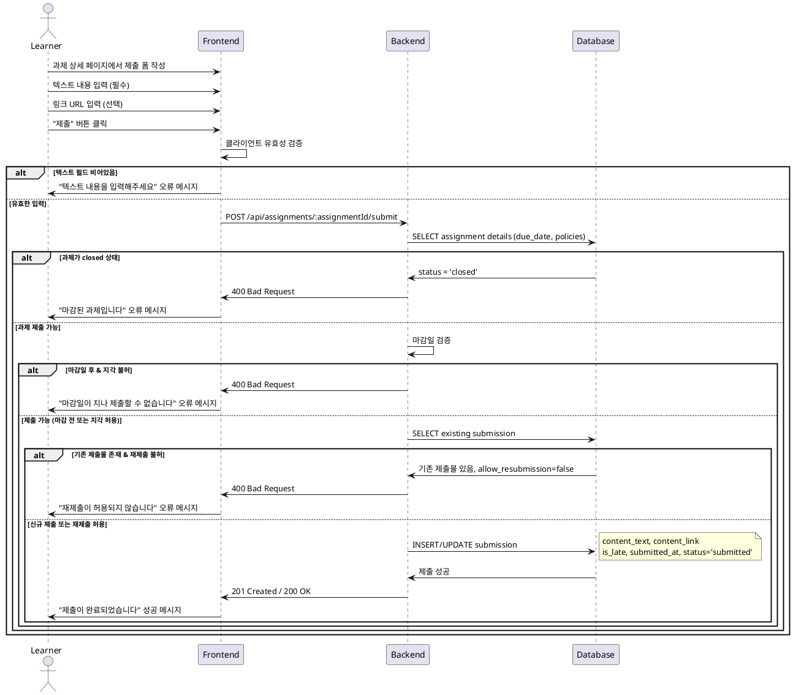

# Use Case 005: 과제 제출/재제출 (Learner)

## Primary Actor
학습자 (Learner)

## Precondition
- 사용자가 Learner 역할로 로그인된 상태
- 사용자가 해당 코스에 수강신청된 상태
- 과제가 published 상태이고 closed가 아님

## Trigger
학습자가 과제 상세 페이지에서 "제출" 또는 "재제출" 버튼을 클릭

## Main Scenario
1. 학습자가 과제 상세 페이지에서 제출 폼에 접근
2. 학습자가 텍스트 필드(필수)에 내용을 입력
3. 학습자가 링크 필드(선택)에 URL을 입력 (있는 경우)
4. 학습자가 "제출" 버튼을 클릭
5. 시스템이 입력 데이터의 유효성을 검증
6. 시스템이 현재 시간과 마감일을 비교
7. 시스템이 제출물 정보를 저장:
   - 마감일 전: status='submitted', is_late=false
   - 마감일 후 & 지각 허용: status='submitted', is_late=true
8. 시스템이 성공 메시지를 표시하고 제출 상태를 업데이트

## Edge Cases
- **마감일 후 지각 불허**: 지각 제출이 허용되지 않는 과제에서 마감 후 제출 시도 시 차단
- **재제출 불허**: 재제출이 허용되지 않는 과제에서 재제출 시도 시 차단
- **빈 텍스트 제출**: 필수 텍스트 필드가 비어있을 때 제출 차단
- **잘못된 URL**: 링크 필드에 유효하지 않은 URL 입력 시 오류 메시지

## Business Rules
- 텍스트 필드는 필수, 링크 필드는 선택사항
- 마감일 이후 제출 시 allow_late_submission=true인 경우에만 허용
- 재제출 시 allow_resubmission=true인 경우에만 허용
- 재제출은 기존 제출물을 UPDATE하는 방식 (새 레코드 생성 X)
- closed 상태의 과제는 제출 불가

## Sequence Diagram

