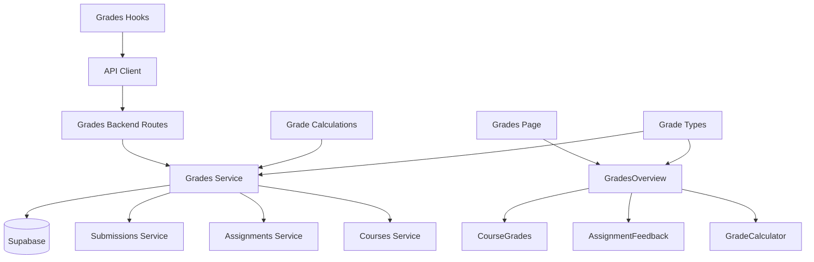

# Use Case 006: 성적 & 피드백 열람 (Learner) - 모듈화 설계

## 개요

### 주요 모듈 목록

| 모듈명 | 위치 | 설명 |
|--------|------|------|
| `grades` | `src/features/grades/` | 학습자 성적 및 피드백 관리를 위한 feature 모듈 |
| `grades/grades-overview` | `src/features/grades/components/grades-overview.tsx` | 성적 개요 컴포넌트 |
| `grades/course-grades` | `src/features/grades/components/course-grades.tsx` | 코스별 성적 컴포넌트 |
| `grades/assignment-feedback` | `src/features/grades/components/assignment-feedback.tsx` | 과제별 피드백 컴포넌트 |
| `grades/grade-calculator` | `src/features/grades/components/grade-calculator.tsx` | 총점 계산 컴포넌트 |
| `grades-backend` | `src/features/grades/backend/` | 성적 조회 및 계산을 위한 API 및 서비스 로직 |
| `grades-hooks` | `src/features/grades/hooks/` | 성적 조회를 위한 React Query hooks |
| `shared/grade-types` | `src/lib/shared/grade-types.ts` | 성적 관련 공통 타입 정의 |
| `shared/grade-calculations` | `src/lib/shared/grade-calculations.ts` | 성적 계산 공통 로직 |

## Diagram

## Implementation Plan

### 1. Shared Modules (공통 모듈)

#### `src/lib/shared/grade-types.ts`
- **목적**: 성적 관련 공통 타입 정의
- **내용**:
  - `LearnerGradeSummary` 인터페이스 (submissionId, assignmentTitle, courseTitle, score, status, isLate, feedback, submittedAt)
  - `CourseGradeTotal` 인터페이스 (courseId, courseTitle, totalScore, assignmentCount)
  - `LearnerGrades` 인터페이스 (submissions, courseTotals)
  - `GradeStatus` enum ('not_submitted', 'submitted', 'graded', 'resubmission_required')
- **단위 테스트**: 타입 정의 검증 및 인터페이스 호환성 테스트

#### `src/lib/shared/grade-calculations.ts`
- **목적**: 성적 계산 공통 로직
- **내용**:
  - `calculateCourseTotal()`: 코스별 총점 계산 함수 (Σ(score × score_weighting) / 100)
  - `getGradeStatus()`: 제출물 상태에 따른 성적 상태 판별
  - `formatGradeDisplay()`: 성적 표시 포맷팅 함수
- **단위 테스트**: 계산 로직 검증 (총점 계산, 상태 판별, 포맷팅)

### 2. Grades Backend Modules

#### `src/features/grades/backend/schema.ts`
- **목적**: 성적 API 요청/응답 스키마 정의
- **내용**:
  - `LearnerGradesResponseSchema`: 학습자 성적 응답 스키마
  - `GradeSummarySchema`: 성적 요약 스키마
  - `CourseTotalSchema`: 코스 총점 스키마
- **단위 테스트**: 스키마 검증 및 데이터 변환 테스트

#### `src/features/grades/backend/service.ts`
- **목적**: 성적 조회 및 계산 비즈니스 로직
- **내용**:
  - `getLearnerGrades()`: 학습자의 모든 성적 정보 조회 및 집계
  - `getSubmissionsWithDetails()`: 제출물 상세 정보 조회 (과제, 코스 조인)
  - `calculateCourseTotals()`: 코스별 총점 계산
  - `getGradeSummaries()`: 성적 요약 데이터 생성
- **단위 테스트**: 데이터 집계 및 계산 로직 테스트

#### `src/features/grades/backend/route.ts`
- **목적**: 성적 관련 Hono 라우트 정의
- **내용**:
  - `GET /api/learner/grades`: 학습자 성적 조회
  - `GET /api/submissions/:submissionId/feedback`: 제출물 피드백 상세 조회
- **QA 시트**: API 엔드포인트 테스트 케이스 (권한 검증, 데이터 계산 검증, 에러 처리)

#### `src/features/grades/backend/error.ts`
- **목적**: 성적 서비스 에러 코드 정의
- **내용**: 성적 조회 관련 에러 코드 및 메시지

### 3. Frontend Components

#### `src/features/grades/components/grades-overview.tsx`
- **목적**: 성적 페이지 메인 컴포넌트 및 레이아웃
- **내용**:
  - 성적 데이터 상태 관리
  - 코스별 성적 및 과제별 피드백 통합 표시
  - 빈 상태 처리 (제출물 없음)
  - 로딩 및 에러 상태 처리
- **QA 시트**: 성적 개요 표시 테스트 (데이터 로딩, 컴포넌트 통합)

#### `src/features/grades/components/course-grades.tsx`
- **목적**: 코스별 성적 표시 컴포넌트
- **내용**:
  - 코스별 과제 목록 및 점수 표시
  - 코스 총점 표시
  - 과제별 상태 표시 (submitted/graded 등)
  - 지각 제출 별도 표시
- **QA 시트**: 코스별 성적 표시 테스트 (점수 계산, 상태 표시)

#### `src/features/grades/components/assignment-feedback.tsx`
- **목적**: 과제별 피드백 표시 컴포넌트
- **내용**:
  - 피드백 내용 표시
  - 점수 및 제출 정보 표시
  - 재제출 필요 시 안내 및 링크
  - 상세 피드백 모달/페이지 트리거
- **QA 시트**: 피드백 표시 테스트 (내용 표시, 상태별 UI, 링크 동작)

#### `src/features/grades/components/grade-calculator.tsx`
- **목적**: 총점 계산 및 표시 컴포넌트
- **내용**:
  - 코스별 총점 계산 및 표시
  - 계산식 설명 표시
  - 점수 비중 고려한 가중 평균
- **QA 시트**: 계산 결과 표시 테스트 (정확성 검증, 포맷팅)

### 4. Frontend Hooks

#### `src/features/grades/hooks/useGrades.ts`
- **목적**: 성적 조회를 위한 React Query hooks
- **내용**:
  - `useLearnerGradesQuery`: 학습자 성적 조회
  - `useSubmissionFeedbackQuery`: 제출물 피드백 상세 조회
  - 캐싱 및 리패칭 로직
- **단위 테스트**: 쿼리 상태 및 데이터 변환 테스트

### 5. Page Integration

#### `src/app/my/grades/page.tsx` (신규)
- **목적**: 학습자 성적 페이지
- **내용**:
  - GradesOverview 컴포넌트 통합
  - Learner 전용 페이지 (역할 검증)
- **QA 시트**: E2E 플로우 테스트 (성적 조회, 피드백 확인, 재제출 링크)

### 6. Supporting Dependencies

#### `src/features/submissions/backend/service.ts` (확장)
- **목적**: 성적 조회를 위한 제출물 서비스 확장
- **내용**:
  - `getLearnerSubmissionsWithDetails()`: 학습자의 제출물 상세 조회 (과제, 코스 정보 포함)
- **단위 테스트**: 조인 쿼리 및 데이터 변환 테스트

### 구현 순서
1. Shared 모듈 구현 (타입, 계산 로직)
2. Grades backend 모듈 구현 (조회 및 계산)
3. Frontend 컴포넌트 구현 (하위 → 상위)
4. Hooks 및 페이지 통합
5. QA 및 테스트 진행
