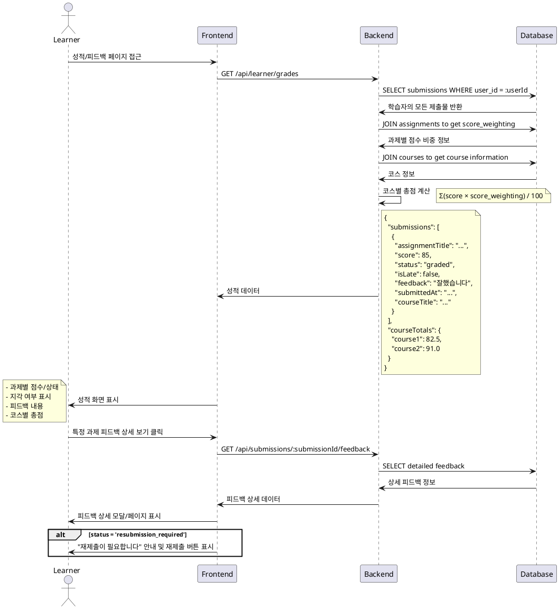

# Use Case 006: 성적 & 피드백 열람 (Learner)

## Primary Actor
학습자 (Learner)

## Precondition
- 사용자가 Learner 역할로 로그인된 상태
- 사용자가 과제를 제출한 이력이 있음

## Trigger
학습자가 성적 페이지 또는 특정 과제의 피드백 페이지에 접근

## Main Scenario
1. 학습자가 성적/피드백 페이지에 접근
2. 시스템이 학습자의 제출물 목록을 조회 (본인 것만)
3. 시스템이 각 제출물의 상태 및 점수 정보를 표시:
   - 과제별 점수 (graded 상태인 경우)
   - 제출 상태 (submitted/graded/resubmission_required)
   - 지각 여부
   - 피드백 내용
4. 시스템이 코스별 총점을 계산하여 표시:
   - 각 과제 점수 × 점수 비중의 합계
5. 학습자가 개별 과제의 상세 피드백을 확인

## Edge Cases
- **제출물 없음**: 제출한 과제가 없을 때 "제출한 과제가 없습니다" 메시지 표시
- **미채점 과제**: 아직 채점되지 않은 과제는 "채점 대기 중" 상태 표시
- **재제출 요청**: resubmission_required 상태인 경우 재제출 안내 메시지 표시
- **삭제된 과제**: 과제가 삭제된 경우에도 기존 제출 기록은 유지하여 표시

## Business Rules
- 본인이 제출한 과제의 점수와 피드백만 열람 가능
- 코스 총점 = Σ(과제 점수 × 해당 과제의 score_weighting) / 100
- graded 상태의 과제만 점수가 표시됨
- 지각 제출된 과제는 별도 표시
- 재제출이 필요한 과제는 재제출 링크 제공

## Sequence Diagram

