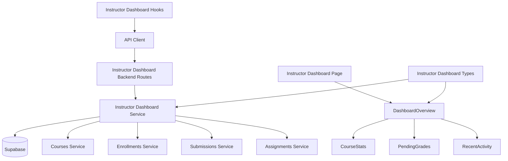

# Use Case 007: Instructor 대시보드 - 모듈화 설계

## 개요

### 주요 모듈 목록

| 모듈명 | 위치 | 설명 |
|--------|------|------|
| `instructor-dashboard` | `src/features/instructor-dashboard/` | Instructor 대시보드 전체를 관리하는 feature 모듈 |
| `instructor-dashboard/dashboard-overview` | `src/features/instructor-dashboard/components/dashboard-overview.tsx` | 대시보드 메인 컴포넌트 |
| `instructor-dashboard/course-stats` | `src/features/instructor-dashboard/components/course-stats.tsx` | 코스 통계 컴포넌트 |
| `instructor-dashboard/pending-grades` | `src/features/instructor-dashboard/components/pending-grades.tsx` | 채점 대기 컴포넌트 |
| `instructor-dashboard/recent-activity` | `src/features/instructor-dashboard/components/recent-activity.tsx` | 최근 활동 컴포넌트 |
| `instructor-dashboard-backend` | `src/features/instructor-dashboard/backend/` | 대시보드 데이터 집계를 위한 API 및 서비스 로직 |
| `instructor-dashboard-hooks` | `src/features/instructor-dashboard/hooks/` | 대시보드 데이터 조회를 위한 React Query hooks |
| `shared/instructor-dashboard-types` | `src/lib/shared/instructor-dashboard-types.ts` | Instructor 대시보드 관련 공통 타입 정의 |

## Diagram

## Implementation Plan

### 1. Shared Modules (공통 모듈)

#### `src/lib/shared/instructor-dashboard-types.ts`
- **목적**: Instructor 대시보드 관련 공통 타입 정의
- **내용**:
  - `InstructorCourseSummary` 인터페이스 (id, title, status, enrollmentCount, pendingGradesCount)
  - `RecentSubmission` 인터페이스 (studentName, assignmentTitle, courseTitle, submittedAt)
  - `CourseStats` 인터페이스 (draft, published, archived 카운트)
  - `InstructorDashboard` 인터페이스 (courses, totalPendingGrades, recentSubmissions, courseStats)
- **단위 테스트**: 타입 정의 검증 및 인터페이스 호환성 테스트

### 2. Instructor Dashboard Backend Modules

#### `src/features/instructor-dashboard/backend/schema.ts`
- **목적**: Instructor 대시보드 API 요청/응답 스키마 정의
- **내용**:
  - `InstructorDashboardResponseSchema`: 대시보드 데이터 응답 스키마
  - `CourseSummarySchema`: 코스 요약 스키마
  - `RecentSubmissionSchema`: 최근 제출물 스키마
- **단위 테스트**: 스키마 검증 및 데이터 변환 테스트

#### `src/features/instructor-dashboard/backend/service.ts`
- **목적**: Instructor 대시보드 데이터 집계 비즈니스 로직
- **내용**:
  - `getInstructorDashboard()`: 강사 대시보드 데이터 전체 조회 및 집계
  - `getInstructorCoursesWithStats()`: 강사 코스 및 통계 조회
  - `getPendingGradesCount()`: 채점 대기 제출물 수 계산
  - `getRecentSubmissions()`: 최근 제출물 목록 조회 (7일 이내)
  - `getCourseStats()`: 코스 상태별 통계 집계
- **단위 테스트**: 데이터 집계 및 계산 로직 테스트

#### `src/features/instructor-dashboard/backend/route.ts`
- **목적**: Instructor 대시보드 관련 Hono 라우트 정의
- **내용**:
  - `GET /api/instructor/dashboard`: 강사 대시보드 데이터 조회
- **QA 시트**: API 엔드포인트 테스트 케이스 (권한 검증, 데이터 집계 검증, 에러 처리)

#### `src/features/instructor-dashboard/backend/error.ts`
- **목적**: Instructor 대시보드 서비스 에러 코드 정의
- **내용**: 대시보드 조회 관련 에러 코드 및 메시지

### 3. Frontend Components

#### `src/features/instructor-dashboard/components/dashboard-overview.tsx`
- **목적**: Instructor 대시보드 메인 컴포넌트 및 레이아웃
- **내용**:
  - 대시보드 데이터 상태 관리
  - 코스 통계, 채점 대기, 최근 활동 컴포넌트 통합
  - 빈 상태 처리 (코스 없음 등)
  - 빠른 액션 버튼들 (코스 생성, 채점하기 등)
- **QA 시트**: 대시보드 레이아웃 테스트 (컴포넌트 통합, 액션 버튼)

#### `src/features/instructor-dashboard/components/course-stats.tsx`
- **목적**: 코스 통계 표시 컴포넌트
- **내용**:
  - 코스 상태별 개수 표시 (draft/published/archived)
  - 각 코스별 수강생 수 및 채점 대기 수 표시
  - 코스 목록 요약
- **QA 시트**: 통계 표시 테스트 (카운트 정확성, 상태별 분류)

#### `src/features/instructor-dashboard/components/pending-grades.tsx`
- **목적**: 채점 대기 제출물 표시 컴포넌트
- **내용**:
  - 총 채점 대기 수 표시
  - 코스별 채점 대기 수 표시
  - 채점 페이지로의 링크
- **QA 시트**: 채점 대기 표시 테스트 (카운트 계산, 링크 동작)

#### `src/features/instructor-dashboard/components/recent-activity.tsx`
- **목적**: 최근 활동 표시 컴포넌트
- **내용**:
  - 최근 제출물 목록 표시 (학생명, 과제명, 코스명, 제출일시)
  - 빈 상태 처리 ("최근 제출물이 없습니다")
  - 각 항목 클릭 시 상세 페이지 이동
- **QA 시트**: 최근 활동 표시 테스트 (목록 표시, 빈 상태, 링크 동작)

### 4. Frontend Hooks

#### `src/features/instructor-dashboard/hooks/useInstructorDashboard.ts`
- **목적**: Instructor 대시보드 데이터 조회를 위한 React Query hook
- **내용**:
  - `useInstructorDashboardQuery`: 강사 대시보드 데이터 조회
  - 캐싱 및 리패칭 로직
  - 에러 처리 및 로딩 상태
- **단위 테스트**: 쿼리 상태 및 데이터 변환 테스트

### 5. Page Integration

#### `src/app/(protected)/dashboard/page.tsx` (기존 확장)
- **목적**: 역할별 대시보드 표시
- **내용**:
  - 현재 사용자 역할에 따라 다른 대시보드 컴포넌트 표시
  - Learner: 기존 GradesOverview
  - Instructor: InstructorDashboardOverview
  - 기본 대시보드 유지 (역할에 따른 분기)
- **QA 시트**: E2E 플로우 테스트 (역할별 대시보드 표시, 데이터 로딩)

### 6. Supporting Dependencies

#### `src/features/courses/backend/service.ts` (확장)
- **목적**: Instructor 코스 조회 기능 추가
- **내용**:
  - `getInstructorCourses()`: 특정 강사의 코스 목록 조회
- **단위 테스트**: 강사별 코스 조회 테스트

#### `src/features/enrollments/backend/service.ts` (확장)
- **목적**: 코스별 수강생 수 조회 기능 추가
- **내용**:
  - `getEnrollmentCountByCourse()`: 코스별 수강생 수 계산
- **단위 테스트**: 수강생 수 계산 테스트

#### `src/features/submissions/backend/service.ts` (확장)
- **목적**: 채점 대기 및 최근 제출물 조회 기능 추가
- **내용**:
  - `getPendingSubmissionsCount()`: 채점 대기 제출물 수 조회
  - `getRecentSubmissionsForInstructor()`: 강사의 최근 제출물 조회
- **단위 테스트**: 제출물 통계 조회 테스트

### 구현 순서
1. Shared 모듈 구현 (타입 정의)
2. Supporting backend 모듈 확장
3. Instructor Dashboard backend 모듈 구현
4. Frontend 컴포넌트 구현 (하위 → 상위)
5. Dashboard 페이지 역할별 분기 구현
6. QA 및 테스트 진행
