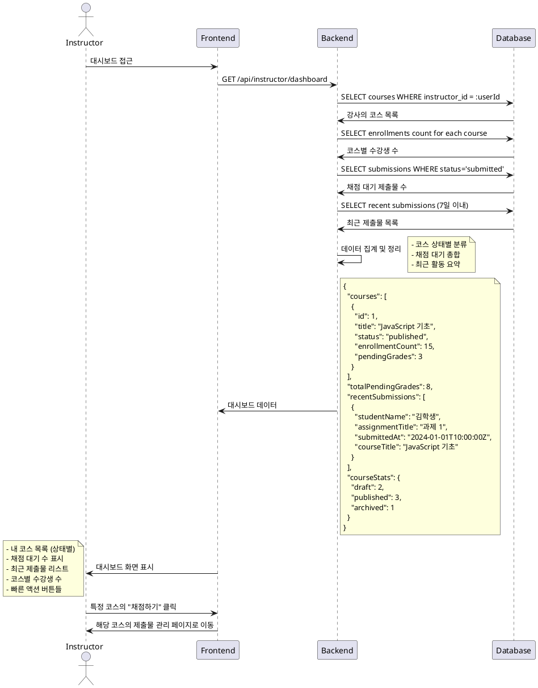

# Use Case 007: Instructor 대시보드

## Primary Actor
강사 (Instructor)

## Precondition
- 사용자가 Instructor 역할로 로그인된 상태

## Trigger
강사가 대시보드 페이지에 접근

## Main Scenario
1. 강사가 대시보드에 접근
2. 시스템이 강사가 개설한 코스 목록을 조회
3. 시스템이 각 코스의 상태별 개수를 집계 (draft/published/archived)
4. 시스템이 채점 대기 중인 제출물 수를 계산
5. 시스템이 최근 제출물 목록을 조회 (최근 7일 이내)
6. 시스템이 대시보드 정보를 표시:
   - 내 코스 목록 및 상태
   - 총 채점 대기 수
   - 최근 제출물 목록
   - 각 코스별 수강생 수

## Edge Cases
- **개설 코스 없음**: 개설한 코스가 없을 때 "코스를 개설해보세요" 안내 메시지 표시
- **채점 대기 없음**: 채점할 제출물이 없을 때 "채점할 과제가 없습니다" 표시
- **최근 제출물 없음**: 최근 제출물이 없을 때 빈 상태 메시지 표시
- **수강생 없음**: 수강생이 없는 코스는 "수강생 없음" 표시

## Business Rules
- 본인이 개설한 코스만 표시
- 채점 대기 = status='submitted' 상태의 제출물 수
- 최근 제출물 기준: 7일 이내 제출된 것들
- 삭제된 코스는 표시하지 않음
- 각 코스별 수강생 수는 enrollments 테이블 기준

## Sequence Diagram

