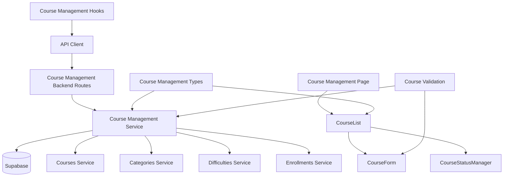

# Use Case 008: 코스 관리 (Instructor) - 모듈화 설계

## 개요

### 주요 모듈 목록

| 모듈명 | 위치 | 설명 |
|--------|------|------|
| `course-management` | `src/features/course-management/` | Instructor 코스 관리를 위한 feature 모듈 |
| `course-management/course-form` | `src/features/course-management/components/course-form.tsx` | 코스 생성/수정 폼 컴포넌트 |
| `course-management/course-list` | `src/features/course-management/components/course-list.tsx` | 코스 목록 관리 컴포넌트 |
| `course-management/course-status-manager` | `src/features/course-management/components/course-status-manager.tsx` | 코스 상태 관리 컴포넌트 |
| `course-management-backend` | `src/features/course-management/backend/` | 코스 CRUD 및 상태 관리를 위한 API 및 서비스 로직 |
| `course-management-hooks` | `src/features/course-management/hooks/` | 코스 관리를 위한 React Query hooks |
| `shared/course-management-types` | `src/lib/shared/course-management-types.ts` | 코스 관리 관련 공통 타입 정의 |
| `shared/course-validation` | `src/lib/shared/course-validation.ts` | 코스 생성/수정 검증 스키마 |

## Diagram

## Implementation Plan

### 1. Shared Modules (공통 모듈)

#### `src/lib/shared/course-management-types.ts`
- **목적**: 코스 관리 관련 공통 타입 정의
- **내용**:
  - `CourseFormData` 인터페이스 (title, description, categoryId, difficultyId, curriculum)
  - `CourseStatusUpdate` 인터페이스 (status: 'draft' | 'published' | 'archived')
  - `InstructorCourse` 인터페이스 (기존 Course + enrollmentCount, canModify 등)
  - `CourseManagementResult` 인터페이스 (성공/실패 결과)
- **단위 테스트**: 타입 정의 검증 및 인터페이스 호환성 테스트

#### `src/lib/shared/course-validation.ts`
- **목적**: 코스 생성/수정 검증 스키마 (Zod 사용)
- **내용**:
  - `courseFormSchema`: 코스 폼 데이터 검증 (제목 필수 등)
  - `courseStatusSchema`: 상태 변경 검증
  - `courseIdSchema`: 코스 ID 검증
- **단위 테스트**: 각 스키마의 유효성 검증 테스트

### 2. Course Management Backend Modules

#### `src/features/course-management/backend/schema.ts`
- **목적**: 코스 관리 API 요청/응답 스키마 정의
- **내용**:
  - `CourseCreateRequestSchema`: 코스 생성 요청 검증
  - `CourseUpdateRequestSchema`: 코스 수정 요청 검증
  - `CourseStatusUpdateRequestSchema`: 상태 변경 요청 검증
  - `InstructorCoursesResponseSchema`: 강사 코스 목록 응답
- **단위 테스트**: 스키마 검증 및 데이터 변환 테스트

#### `src/features/course-management/backend/service.ts`
- **목적**: 코스 CRUD 및 상태 관리 비즈니스 로직
- **내용**:
  - `createCourse()`: 코스 생성 (draft 상태로)
  - `updateCourse()`: 코스 수정 (권한 및 상태 검증 포함)
  - `updateCourseStatus()`: 코스 상태 변경 (상태 전환 규칙 적용)
  - `getInstructorCourses()`: 강사 코스 목록 조회
  - `deleteCourse()`: 코스 삭제 (수강생 검증 포함)
  - `validateCourseOwnership()`: 코스 소유권 검증
  - `validateStatusTransition()`: 상태 전환 가능 여부 검증
- **단위 테스트**: CRUD 로직 및 검증 로직 테스트

#### `src/features/course-management/backend/route.ts`
- **목적**: 코스 관리 관련 Hono 라우트 정의
- **내용**:
  - `GET /api/instructor/courses`: 강사 코스 목록 조회
  - `POST /api/courses`: 코스 생성
  - `PUT /api/courses/:courseId`: 코스 수정
  - `PATCH /api/courses/:courseId/status`: 코스 상태 변경
  - `DELETE /api/courses/:courseId`: 코스 삭제
- **QA 시트**: API 엔드포인트 테스트 케이스 (권한 검증, 상태 전환, 유효성 검증)

#### `src/features/course-management/backend/error.ts`
- **목적**: 코스 관리 서비스 에러 코드 정의
- **내용**: 권한, 상태 전환, 유효성 관련 에러 코드 및 메시지

### 3. Frontend Components

#### `src/features/course-management/components/course-form.tsx`
- **목적**: 코스 생성/수정 폼 컴포넌트
- **내용**:
  - 제목 입력 (필수)
  - 설명/커리큘럼 텍스트 영역
  - 카테고리/난이도 드롭다운 (메타데이터 조회)
  - 클라이언트 유효성 검증
  - 생성/수정 모드 지원
  - 로딩 및 에러 상태
- **QA 시트**: 폼 유효성 테스트 (필수 필드, 데이터 타입, 제출 상태)

#### `src/features/course-management/components/course-list.tsx`
- **목적**: 코스 목록 및 관리 인터페이스
- **내용**:
  - 코스 목록 표시 (상태별 정렬)
  - 각 코스별 액션 버튼 (수정, 상태 변경, 삭제)
  - 수강생 수 표시
  - 빈 상태 처리 ("코스가 없습니다")
  - 새 코스 생성 버튼
- **QA 시트**: 목록 표시 테스트 (정렬, 액션 버튼, 빈 상태)

#### `src/features/course-management/components/course-status-manager.tsx`
- **목적**: 코스 상태 변경 컴포넌트
- **내용**:
  - 현재 상태 표시
  - 가능한 상태 전환 옵션 표시 (드롭다운/버튼)
  - 상태 변경 확인 다이얼로그
  - 상태별 제한사항 안내
- **QA 시트**: 상태 관리 테스트 (전환 옵션, 확인 다이얼로그, 제한 적용)

### 4. Frontend Hooks

#### `src/features/course-management/hooks/useCourseManagement.ts`
- **목적**: 코스 관리를 위한 React Query hooks
- **내용**:
  - `useInstructorCoursesQuery`: 강사 코스 목록 조회
  - `useCreateCourseMutation`: 코스 생성 뮤테이션
  - `useUpdateCourseMutation`: 코스 수정 뮤테이션
  - `useUpdateCourseStatusMutation`: 상태 변경 뮤테이션
  - `useDeleteCourseMutation`: 코스 삭제 뮤테이션
- **단위 테스트**: 뮤테이션 성공/실패 시나리오 및 쿼리 상태 테스트

### 5. Page Integration

#### `src/app/instructor/courses/page.tsx` (신규)
- **목적**: Instructor 코스 관리 페이지
- **내용**:
  - CourseList 컴포넌트 통합
  - Instructor 권한 검증
- **QA 시트**: E2E 플로우 테스트 (코스 생성, 수정, 상태 변경, 삭제)

#### `src/app/instructor/courses/new/page.tsx` (신규)
- **목적**: 코스 생성 페이지
- **내용**:
  - CourseForm 컴포넌트 통합 (생성 모드)
- **QA 시트**: E2E 플로우 테스트 (코스 생성, 유효성 검증)

#### `src/app/instructor/courses/[courseId]/edit/page.tsx` (신규)
- **목적**: 코스 수정 페이지
- **내용**:
  - CourseForm 컴포넌트 통합 (수정 모드)
  - 권한 검증
- **QA 시트**: E2E 플로우 테스트 (코스 수정, 권한 검증)

### 6. Supporting Dependencies

#### `src/features/categories/backend/service.ts` (신규)
- **목적**: 카테고리 메타데이터 조회
- **내용**:
  - `getCategories()`: 카테고리 목록 조회
- **단위 테스트**: 메타데이터 조회 테스트

#### `src/features/difficulties/backend/service.ts` (신규)
- **목적**: 난이도 메타데이터 조회
- **내용**:
  - `getDifficulties()`: 난이도 목록 조회
- **단위 테스트**: 메타데이터 조회 테스트

### 구현 순서
1. Shared 모듈 구현 (타입, 검증 스키마)
2. Supporting backend 모듈 구현 (categories, difficulties)
3. Course Management backend 모듈 구현 (CRUD 및 상태 관리)
4. Frontend 컴포넌트 구현 (하위 → 상위)
5. Hooks 및 페이지 통합
6. QA 및 테스트 진행
