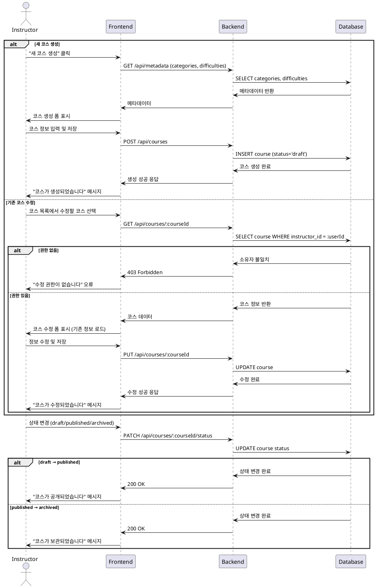

# Use Case 008: 코스 관리 (Instructor)

## Primary Actor
강사 (Instructor)

## Precondition
- 사용자가 Instructor 역할로 로그인된 상태

## Trigger
강사가 코스 생성 또는 기존 코스 수정을 위해 코스 관리 페이지에 접근

## Main Scenario
1. 강사가 "새 코스 생성" 또는 "기존 코스 수정"을 선택
2. 시스템이 코스 정보 입력 폼을 제시:
   - 제목 (필수)
   - 소개/설명
   - 카테고리 선택 (categories 테이블 참조)
   - 난이도 선택 (difficulties 테이블 참조)
   - 커리큘럼 정보
3. 강사가 필요한 정보를 입력하고 저장
4. 시스템이 코스를 draft 상태로 저장
5. 강사가 상태 전환을 선택:
   - draft → published: 학습자에게 공개
   - published → archived: 신규 수강신청 차단
6. 시스템이 상태 변경을 적용하고 결과를 반영

## Edge Cases
- **제목 누락**: 필수 필드인 제목이 비어있을 때 저장 차단
- **권한 없음**: 다른 강사의 코스 수정 시도 시 403 오류
- **수강생 있는 코스 삭제**: 수강생이 있는 코스 삭제 시도 시 경고 메시지
- **이미 공개된 코스**: published 상태의 코스를 다시 draft로 변경 시도 시 제한

## Business Rules
- 코스 소유자(instructor_id)만 해당 코스를 수정 가능
- draft 상태에서만 자유로운 수정 가능
- published 상태에서는 중요 정보(제목, 카테고리, 난이도) 수정 제한
- archived 상태의 코스는 신규 수강신청 불가, 기존 수강생은 유지
- 삭제된 강사의 코스는 instructor_id가 NULL로 설정되지만 코스는 유지

## Sequence Diagram

