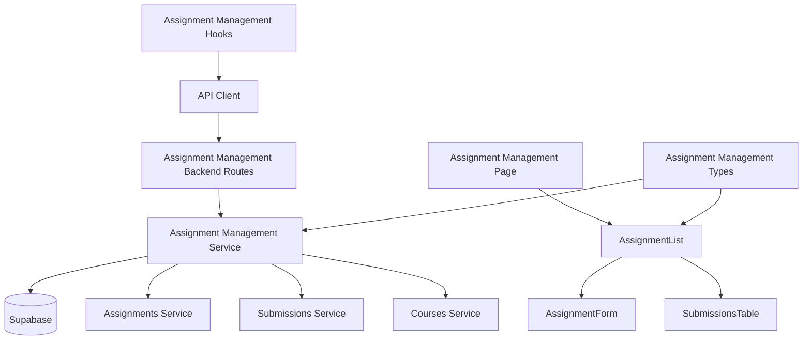

# Use Case 009: 과제 관리 (Instructor) - 모듈화 설계

## 개요

### 주요 모듈 목록

| 모듈명 | 위치 | 설명 |
|--------|------|------|
| `assignment-management` | `src/features/assignment-management/` | Instructor 과제 관리를 위한 feature 모듈 |
| `assignment-management/assignment-form` | `src/features/assignment-management/components/assignment-form.tsx` | 과제 생성/수정 폼 컴포넌트 |
| `assignment-management/assignment-list` | `src/features/assignment-management/components/assignment-list.tsx` | 과제 목록 관리 컴포넌트 |
| `assignment-management/submissions-table` | `src/features/assignment-management/components/submissions-table.tsx` | 제출물 관리 테이블 컴포넌트 |
| `assignment-management-backend` | `src/features/assignment-management/backend/` | 과제 CRUD 및 제출물 관리를 위한 API 및 서비스 로직 |
| `assignment-management-hooks` | `src/features/assignment-management/hooks/` | 과제 관리를 위한 React Query hooks |
| `shared/assignment-management-types` | `src/lib/shared/assignment-management-types.ts` | 과제 관리 관련 공통 타입 정의 |

## Diagram

## Implementation Plan

### 1. Shared Modules (공통 모듈)

#### `src/lib/shared/assignment-management-types.ts`
- **목적**: 과제 관리 관련 공통 타입 정의
- **내용**:
  - `AssignmentFormData` 인터페이스 (title, description, dueDate, scoreWeighting, allowLateSubmission, allowResubmission)
  - `AssignmentWithSubmissions` 인터페이스 (기존 Assignment + submissionsCount, pendingCount)
  - `SubmissionForGrading` 인터페이스 (id, studentName, submittedAt, isLate, status, score, feedback)
  - `AssignmentManagementResult` 인터페이스 (성공/실패 결과)
- **단위 테스트**: 타입 정의 검증 및 인터페이스 호환성 테스트

### 2. Assignment Management Backend Modules

#### `src/features/assignment-management/backend/schema.ts`
- **목적**: 과제 관리 API 요청/응답 스키마 정의
- **내용**:
  - `AssignmentCreateRequestSchema`: 과제 생성 요청 검증
  - `AssignmentUpdateRequestSchema`: 과제 수정 요청 검증
  - `AssignmentStatusUpdateRequestSchema`: 상태 변경 요청 검증
  - `AssignmentSubmissionsResponseSchema`: 과제별 제출물 목록 응답
- **단위 테스트**: 스키마 검증 및 데이터 변환 테스트

#### `src/features/assignment-management/backend/service.ts`
- **목적**: 과제 CRUD 및 제출물 관리 비즈니스 로직
- **내용**:
  - `createAssignment()`: 과제 생성 (draft 상태로)
  - `updateAssignment()`: 과제 수정 (권한 검증 포함)
  - `updateAssignmentStatus()`: 과제 상태 변경
  - `getCourseAssignments()`: 코스별 과제 목록 조회 (권한 검증)
  - `getAssignmentSubmissions()`: 과제별 제출물 목록 조회 (채점용)
  - `validateAssignmentOwnership()`: 과제 소유권 검증 (코스 소유자 확인)
  - `validateAssignmentData()`: 과제 데이터 유효성 검증 (점수 비중, 마감일 등)
- **단위 테스트**: CRUD 로직 및 검증 로직 테스트

#### `src/features/assignment-management/backend/route.ts`
- **목적**: 과제 관리 관련 Hono 라우트 정의
- **내용**:
  - `GET /api/courses/:courseId/assignments`: 코스별 과제 목록 조회
  - `POST /api/assignments`: 과제 생성
  - `PUT /api/assignments/:assignmentId`: 과제 수정
  - `PATCH /api/assignments/:assignmentId/status`: 과제 상태 변경
  - `GET /api/assignments/:assignmentId/submissions`: 과제별 제출물 목록
- **QA 시트**: API 엔드포인트 테스트 케이스 (권한 검증, 유효성 검증, 상태 관리)

#### `src/features/assignment-management/backend/error.ts`
- **목적**: 과제 관리 서비스 에러 코드 정의
- **내용**: 권한, 유효성, 상태 관련 에러 코드 및 메시지

### 3. Frontend Components

#### `src/features/assignment-management/components/assignment-form.tsx`
- **목적**: 과제 생성/수정 폼 컴포넌트
- **내용**:
  - 제목 입력 (필수)
  - 설명 텍스트 영역
  - 마감일 날짜 선택기
  - 점수 비중 슬라이더/입력 (0-100)
  - 지각 제출 허용 토글
  - 재제출 허용 토글
  - 클라이언트 유효성 검증
  - 생성/수정 모드 지원
- **QA 시트**: 폼 유효성 테스트 (필수 필드, 범위 검증, 날짜 검증)

#### `src/features/assignment-management/components/assignment-list.tsx`
- **목적**: 코스별 과제 목록 및 관리 인터페이스
- **내용**:
  - 과제 목록 표시 (상태별 정렬)
  - 각 과제별 정보 (마감일, 제출물 수, 상태)
  - 액션 버튼 (수정, 상태 변경, 제출물 보기)
  - 빈 상태 처리 ("과제가 없습니다")
  - 새 과제 생성 버튼
- **QA 시트**: 목록 표시 테스트 (정렬, 액션 버튼, 상태 표시)

#### `src/features/assignment-management/components/submissions-table.tsx`
- **목적**: 제출물 관리 및 채점 테이블
- **내용**:
  - 제출물 목록 테이블 (학생명, 제출일시, 지각 여부, 상태, 점수)
  - 필터링 옵션 (상태별, 지각 제출만)
  - 채점 인터페이스 (점수 입력, 피드백 입력)
  - 일괄 채점 옵션
  - 정렬 및 페이지네이션
- **QA 시트**: 테이블 기능 테스트 (필터링, 채점, 정렬, 페이지네이션)

### 4. Frontend Hooks

#### `src/features/assignment-management/hooks/useAssignmentManagement.ts`
- **목적**: 과제 관리를 위한 React Query hooks
- **내용**:
  - `useCourseAssignmentsQuery`: 코스별 과제 목록 조회
  - `useCreateAssignmentMutation`: 과제 생성 뮤테이션
  - `useUpdateAssignmentMutation`: 과제 수정 뮤테이션
  - `useUpdateAssignmentStatusMutation`: 상태 변경 뮤테이션
  - `useAssignmentSubmissionsQuery`: 과제별 제출물 목록 조회
- **단위 테스트**: 뮤테이션 및 쿼리 상태 테스트

### 5. Page Integration

#### `src/app/instructor/courses/[courseId]/assignments/page.tsx` (신규)
- **목적**: 코스별 과제 관리 페이지
- **내용**:
  - AssignmentList 컴포넌트 통합
  - 코스 소유권 검증
- **QA 시트**: E2E 플로우 테스트 (과제 생성, 수정, 상태 변경)

#### `src/app/instructor/assignments/new/page.tsx` (신규)
- **목적**: 과제 생성 페이지
- **내용**:
  - AssignmentForm 컴포넌트 통합 (생성 모드)
  - 코스 선택 옵션
- **QA 시트**: E2E 플로우 테스트 (과제 생성, 유효성 검증)

#### `src/app/instructor/assignments/[assignmentId]/edit/page.tsx` (신규)
- **목적**: 과제 수정 페이지
- **내용**:
  - AssignmentForm 컴포넌트 통합 (수정 모드)
  - 권한 검증
- **QA 시트**: E2E 플로우 테스트 (과제 수정, 권한 검증)

#### `src/app/instructor/assignments/[assignmentId]/submissions/page.tsx` (신규)
- **목적**: 제출물 관리 페이지
- **내용**:
  - SubmissionsTable 컴포넌트 통합
  - 채점 인터페이스
- **QA 시트**: E2E 플로우 테스트 (제출물 조회, 채점, 필터링)

### 구현 순서
1. Shared 모듈 구현 (타입 정의)
2. Assignment Management backend 모듈 구현
3. Frontend 컴포넌트 구현 (하위 → 상위)
4. Hooks 및 페이지 통합
5. QA 및 테스트 진행
