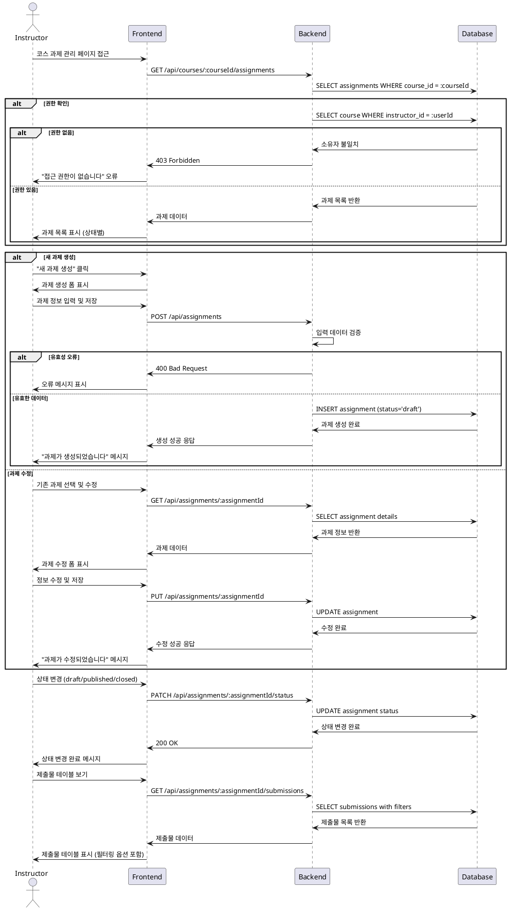

# Use Case 009: 과제 관리 (Instructor)

## Primary Actor
강사 (Instructor)

## Precondition
- 사용자가 Instructor 역할로 로그인된 상태
- 사용자가 소유한 코스가 존재

## Trigger
강사가 과제 생성, 수정, 또는 제출물 관리를 위해 과제 관리 페이지에 접근

## Main Scenario
1. 강사가 특정 코스의 과제 관리 페이지에 접근
2. 시스템이 해당 코스의 과제 목록을 표시 (모든 상태)
3. 강사가 "새 과제 생성" 또는 "기존 과제 수정"을 선택
4. 시스템이 과제 정보 입력 폼을 제시:
   - 제목 (필수)
   - 설명
   - 마감일
   - 점수 비중 (0-100%)
   - 지각 제출 허용 여부
   - 재제출 허용 여부
5. 강사가 과제 정보를 입력하고 저장 (draft 상태)
6. 강사가 상태 전환을 수행:
   - draft → published: 학습자에게 노출
   - published → closed: 제출 마감
7. 강사가 제출물 테이블에서 필터링 및 채점 관리

## Edge Cases
- **권한 없음**: 다른 강사의 코스 과제 접근 시 403 오류
- **제목 누락**: 필수 필드 누락 시 저장 차단
- **잘못된 점수 비중**: 0-100 범위를 벗어난 값 입력 시 오류
- **마감일 과거**: 현재보다 과거 날짜 설정 시 경고
- **수강생 있는 과제 삭제**: 제출물이 있는 과제 삭제 시도 시 경고

## Business Rules
- 소유 코스의 과제만 생성/수정 가능
- 점수 비중은 0-100% 범위 내에서 설정
- published 상태에서만 학습자가 과제를 볼 수 있음
- 마감일 이후 자동으로 closed 상태로 전환 (시스템 배치)
- closed 상태에서는 제출 불가, 채점만 가능

## Sequence Diagram

