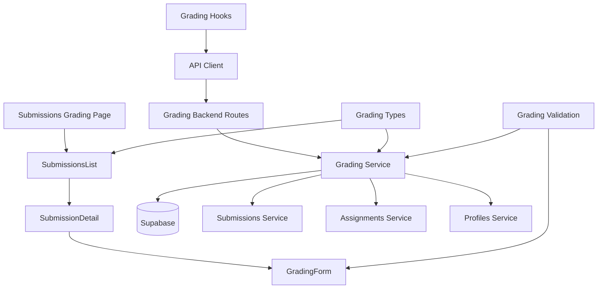

# Use Case 010: 제출물 채점 & 피드백 (Instructor) - 모듈화 설계

## 개요

### 주요 모듈 목록

| 모듈명 | 위치 | 설명 |
|--------|------|------|
| `grading` | `src/features/grading/` | 제출물 채점 및 피드백을 위한 feature 모듈 |
| `grading/submissions-list` | `src/features/grading/components/submissions-list.tsx` | 채점 대상 제출물 목록 컴포넌트 |
| `grading/grading-form` | `src/features/grading/components/grading-form.tsx` | 채점 입력 폼 컴포넌트 |
| `grading/submission-detail` | `src/features/grading/components/submission-detail.tsx` | 제출물 상세 표시 컴포넌트 |
| `grading-backend` | `src/features/grading/backend/` | 채점 및 피드백을 위한 API 및 서비스 로직 |
| `grading-hooks` | `src/features/grading/hooks/` | 채점 기능을 위한 React Query hooks |
| `shared/grading-types` | `src/lib/shared/grading-types.ts` | 채점 관련 공통 타입 정의 |
| `shared/grading-validation` | `src/lib/shared/grading-validation.ts` | 채점 데이터 검증 스키마 |

## Diagram

## Implementation Plan

### 1. Shared Modules (공통 모듈)

#### `src/lib/shared/grading-types.ts`
- **목적**: 채점 관련 공통 타입 정의
- **내용**:
  - `GradingFormData` 인터페이스 (score, feedback, requiresResubmission)
  - `SubmissionForGrading` 인터페이스 (기존 Submission + studentName, studentEmail)
  - `GradingResult` 인터페이스 (성공/실패 및 업데이트된 제출물 정보)
  - `SubmissionFilter` enum ('all', 'ungraded', 'late', 'resubmission_required')
- **단위 테스트**: 타입 정의 검증 및 인터페이스 호환성 테스트

#### `src/lib/shared/grading-validation.ts`
- **목적**: 채점 데이터 검증 스키마 (Zod 사용)
- **내용**:
  - `gradingFormSchema`: 채점 폼 데이터 검증 (점수 범위, 피드백 필수)
  - `submissionIdSchema`: 제출물 ID 검증
  - `gradingUpdateSchema`: 채점 업데이트 데이터 검증
- **단위 테스트**: 각 스키마의 유효성 검증 테스트

### 2. Grading Backend Modules

#### `src/features/grading/backend/schema.ts`
- **목적**: 채점 API 요청/응답 스키마 정의
- **내용**:
  - `GradingRequestSchema`: 채점 요청 검증
  - `ResubmissionRequestSchema`: 재제출 요청 검증
  - `SubmissionsForGradingResponseSchema`: 채점용 제출물 목록 응답
  - `SubmissionDetailForGradingResponseSchema`: 채점용 제출물 상세 응답
- **단위 테스트**: 스키마 검증 및 데이터 변환 테스트

#### `src/features/grading/backend/service.ts`
- **목적**: 채점 및 피드백 비즈니스 로직
- **내용**:
  - `getSubmissionsForGrading()`: 채점 대상 제출물 목록 조회 (필터링 지원)
  - `getSubmissionForGrading()`: 개별 제출물 상세 조회 (권한 검증 포함)
  - `gradeSubmission()`: 제출물 채점 및 피드백 저장
  - `requestResubmission()`: 재제출 요청
  - `validateGradingPermission()`: 채점 권한 검증 (과제 소유자 확인)
  - `validateGradingData()`: 채점 데이터 유효성 검증
- **단위 테스트**: 채점 로직 및 권한 검증 테스트

#### `src/features/grading/backend/route.ts`
- **목적**: 채점 관련 Hono 라우트 정의
- **내용**:
  - `GET /api/assignments/:assignmentId/submissions`: 채점용 제출물 목록 조회
  - `GET /api/submissions/:submissionId/grading`: 채점용 제출물 상세 조회
  - `PATCH /api/submissions/:submissionId/grade`: 제출물 채점
  - `PATCH /api/submissions/:submissionId/resubmit`: 재제출 요청
- **QA 시트**: API 엔드포인트 테스트 케이스 (권한 검증, 유효성 검증, 상태 업데이트)

#### `src/features/grading/backend/error.ts`
- **목적**: 채점 서비스 에러 코드 정의
- **내용**: 권한, 유효성, 상태 관련 에러 코드 및 메시지

### 3. Frontend Components

#### `src/features/grading/components/submissions-list.tsx`
- **목적**: 채점 대상 제출물 목록 컴포넌트
- **내용**:
  - 제출물 목록 테이블 (학생명, 제출일시, 지각 여부, 상태, 점수)
  - 필터링 옵션 (미채점, 지각, 재제출 요청)
  - 정렬 옵션 (제출일시, 학생명, 상태)
  - 각 항목 클릭 시 상세 채점 페이지 이동
  - 채점 진행률 표시
- **QA 시트**: 목록 기능 테스트 (필터링, 정렬, 링크 동작)

#### `src/features/grading/components/submission-detail.tsx`
- **목적**: 채점용 제출물 상세 표시 컴포넌트
- **내용**:
  - 학습자 정보 표시 (이름, 이메일)
  - 제출 내용 표시 (텍스트, 링크)
  - 제출 정보 표시 (제출일시, 지각 여부, 현재 상태)
  - 채점 폼 통합
  - 기존 채점 정보 표시 (있는 경우)
- **QA 시트**: 상세 정보 표시 테스트 (데이터 바인딩, 상태 표시)

#### `src/features/grading/components/grading-form.tsx`
- **목적**: 채점 입력 폼 컴포넌트
- **내용**:
  - 점수 입력 필드 (0-100, 슬라이더/입력)
  - 피드백 텍스트 영역 (필수)
  - 재제출 요청 토글
  - 클라이언트 유효성 검증
  - 제출/저장 버튼
  - 로딩 상태 표시
- **QA 시트**: 폼 유효성 테스트 (점수 범위, 필수 필드, 제출 상태)

### 4. Frontend Hooks

#### `src/features/grading/hooks/useGrading.ts`
- **목적**: 채점 기능을 위한 React Query hooks
- **내용**:
  - `useSubmissionsForGradingQuery`: 채점 대상 제출물 목록 조회
  - `useSubmissionForGradingQuery`: 채점용 제출물 상세 조회
  - `useGradeSubmissionMutation`: 제출물 채점 뮤테이션
  - `useRequestResubmissionMutation`: 재제출 요청 뮤테이션
- **단위 테스트**: 뮤테이션 성공/실패 시나리오 및 쿼리 상태 테스트

### 5. Page Integration

#### `src/app/instructor/assignments/[assignmentId]/grading/page.tsx` (신규)
- **목적**: 과제별 채점 페이지
- **내용**:
  - SubmissionsList 컴포넌트 통합
  - 과제 권한 검증
- **QA 시트**: E2E 플로우 테스트 (제출물 목록 조회, 필터링)

#### `src/app/instructor/submissions/[submissionId]/grade/page.tsx` (신규)
- **목적**: 개별 제출물 채점 페이지
- **내용**:
  - SubmissionDetail과 GradingForm 컴포넌트 통합
  - 채점 권한 검증
- **QA 시트**: E2E 플로우 테스트 (채점 입력, 저장, 유효성 검증)

### 6. Supporting Dependencies

#### `src/features/submissions/backend/service.ts` (확장)
- **목적**: 채점을 위한 제출물 업데이트 기능 추가
- **내용**:
  - `updateSubmissionGrading()`: 채점 정보 업데이트
  - `updateSubmissionStatus()`: 제출물 상태 업데이트 (resubmission_required)
- **단위 테스트**: 채점 업데이트 로직 테스트

#### `src/features/profiles/backend/service.ts` (신규)
- **목적**: 학습자 정보 조회 기능
- **내용**:
  - `getProfileById()`: 사용자 프로필 조회 (채점 시 학생 정보 표시용)
- **단위 테스트**: 프로필 조회 테스트

### 구현 순서
1. Shared 모듈 구현 (타입, 검증 스키마)
2. Supporting backend 모듈 확장
3. Grading backend 모듈 구현 (권한 검증 및 채점 로직)
4. Frontend 컴포넌트 구현 (하위 → 상위)
5. Hooks 및 페이지 통합
6. QA 및 테스트 진행
