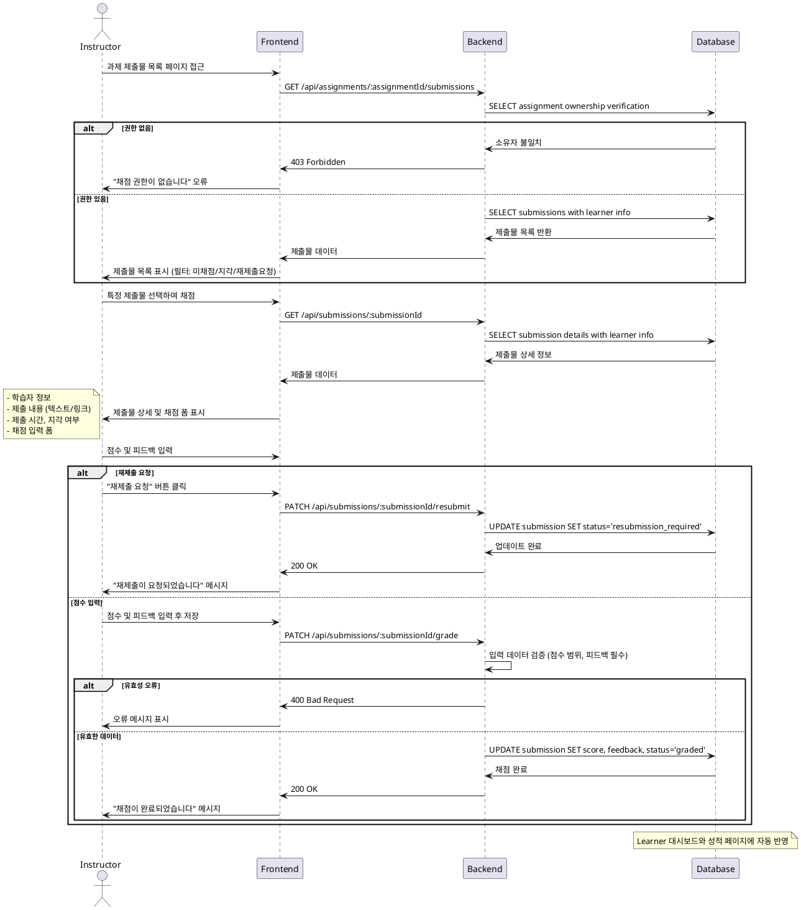

# Use Case 010: 제출물 채점 & 피드백 (Instructor)

## Primary Actor
강사 (Instructor)

## Precondition
- 사용자가 Instructor 역할로 로그인된 상태
- 학습자가 제출한 과제가 존재 (status='submitted')

## Trigger
강사가 제출물 목록에서 특정 제출물을 선택하여 채점

## Main Scenario
1. 강사가 과제의 제출물 목록 페이지에 접근
2. 시스템이 제출물 목록을 표시 (필터링 옵션 포함)
3. 강사가 채점할 제출물을 선택
4. 시스템이 제출물 상세 정보를 표시:
   - 학습자 정보
   - 제출 내용 (텍스트, 링크)
   - 제출 시간 및 지각 여부
5. 강사가 채점 정보를 입력:
   - 점수 (0-100)
   - 피드백 (필수)
   - 재제출 요청 여부 선택
6. 시스템이 제출물 상태를 업데이트:
   - 점수 입력 시: status='graded'
   - 재제출 요청 시: status='resubmission_required'
7. 시스템이 학습자에게 피드백을 제공

## Edge Cases
- **권한 없음**: 다른 강사의 과제 제출물 채점 시도 시 403 오류
- **점수 범위 초과**: 0-100 범위를 벗어난 점수 입력 시 오류
- **피드백 누락**: 필수 피드백 미입력 시 저장 차단
- **이미 채점된 제출물**: 이미 graded 상태인 제출물 재채점 시 업데이트
- **삭제된 제출물**: 존재하지 않는 제출물 접근 시 404 오류

## Business Rules
- 소유 과제의 제출물만 채점 가능
- 점수는 0-100 정수 범위 내에서 설정
- 피드백은 필수 입력 사항
- 재제출 요청 시 기존 점수와 피드백은 유지
- 재제출 완료 후 재채점 가능

## Sequence Diagram

