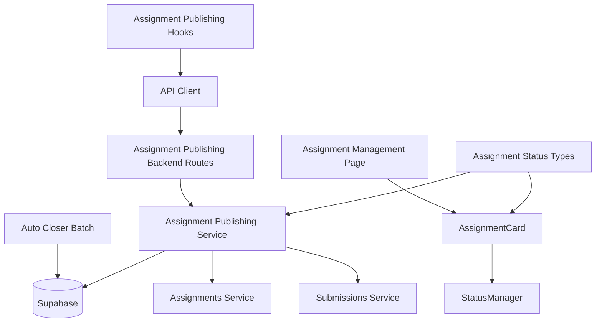

# Use Case 011: Assignment 게시/마감 (Instructor) - 모듈화 설계

## 개요

### 주요 모듈 목록

| 모듈명 | 위치 | 설명 |
|--------|------|------|
| `assignment-publishing` | `src/features/assignment-publishing/` | 과제 게시/마감 상태 관리를 위한 feature 모듈 |
| `assignment-publishing/status-manager` | `src/features/assignment-publishing/components/status-manager.tsx` | 과제 상태 변경 UI 컴포넌트 |
| `assignment-publishing/assignment-card` | `src/features/assignment-publishing/components/assignment-card.tsx` | 상태별 과제 카드 컴포넌트 |
| `assignment-publishing/auto-closer` | `src/features/assignment-publishing/backend/auto-closer.ts` | 자동 마감 배치 로직 |
| `assignment-publishing-backend` | `src/features/assignment-publishing/backend/` | 과제 상태 관리 API 및 서비스 로직 |
| `assignment-publishing-hooks` | `src/features/assignment-publishing/hooks/` | 과제 상태 관리를 위한 React Query hooks |
| `shared/assignment-status-types` | `src/lib/shared/assignment-status-types.ts` | 과제 상태 관련 공통 타입 정의 |

## Diagram

## Implementation Plan

### 1. Shared Modules (공통 모듈)

#### `src/lib/shared/assignment-status-types.ts`
- **목적**: 과제 상태 관련 공통 타입 정의
- **내용**:
  - `AssignmentStatusTransition` 인터페이스 (fromStatus, toStatus, allowed, requiresConfirmation)
  - `StatusChangeResult` 인터페이스 (성공/실패 및 변경된 상태 정보)
  - `AutoCloseCriteria` 인터페이스 (마감일 기준, 배치 실행 주기)
- **단위 테스트**: 타입 정의 검증 및 상태 전환 규칙 테스트

### 2. Assignment Publishing Backend Modules

#### `src/features/assignment-publishing/backend/schema.ts`
- **목적**: 과제 상태 관리 API 요청/응답 스키마 정의
- **내용**:
  - `StatusUpdateRequestSchema`: 상태 변경 요청 검증
  - `StatusUpdateResponseSchema`: 상태 변경 응답 스키마
  - `AssignmentStatusValidationSchema`: 상태 전환 검증 스키마
- **단위 테스트**: 스키마 검증 및 데이터 변환 테스트

#### `src/features/assignment-publishing/backend/service.ts`
- **목적**: 과제 상태 관리 비즈니스 로직
- **내용**:
  - `updateAssignmentStatus()`: 과제 상태 변경 (권한 및 규칙 검증 포함)
  - `validateStatusTransition()`: 상태 전환 가능 여부 검증
  - `getAllowedStatusTransitions()`: 현재 상태에서 가능한 전환 옵션 조회
  - `checkAssignmentConstraints()`: 상태 변경 제약 조건 확인 (제출물 존재 등)
  - `publishAssignment()`: draft → published 전환
  - `closeAssignment()`: published → closed 전환
- **단위 테스트**: 상태 전환 로직 및 검증 규칙 테스트

#### `src/features/assignment-publishing/backend/auto-closer.ts`
- **목적**: 자동 마감 배치 처리 로직
- **내용**:
  - `findDueAssignments()`: 마감일이 도래한 published 과제 조회
  - `autoCloseAssignments()`: 자동으로 상태를 closed로 변경
  - `scheduleAutoClose()`: 배치 작업 스케줄링 (외부 스케줄러 연동)
  - `logAutoCloseAction()`: 자동 마감 작업 로그 기록
- **단위 테스트**: 자동 마감 로직 및 배치 처리 테스트

#### `src/features/assignment-publishing/backend/route.ts`
- **목적**: 과제 상태 관리 관련 Hono 라우트 정의
- **내용**:
  - `PATCH /api/assignments/:assignmentId/status`: 과제 상태 변경
  - `GET /api/assignments/:assignmentId/status-options`: 가능한 상태 전환 옵션 조회
- **QA 시트**: API 엔드포인트 테스트 케이스 (상태 전환 검증, 권한 확인, 제약 조건)

#### `src/features/assignment-publishing/backend/error.ts`
- **목적**: 과제 상태 관리 서비스 에러 코드 정의
- **내용**: 상태 전환, 권한, 제약 조건 관련 에러 코드 및 메시지

### 3. Frontend Components

#### `src/features/assignment-publishing/components/status-manager.tsx`
- **목적**: 과제 상태 변경 UI 컴포넌트
- **내용**:
  - 현재 상태 표시
  - 가능한 상태 전환 버튼들 (게시, 마감 등)
  - 상태별 버튼 스타일 및 텍스트
  - 확인 다이얼로그 (중요한 상태 변경 시)
  - 로딩 상태 및 결과 피드백
- **QA 시트**: 상태 변경 UI 테스트 (버튼 표시, 확인 다이얼로그, 결과 피드백)

#### `src/features/assignment-publishing/components/assignment-card.tsx`
- **목적**: 상태별 과제 정보 카드 컴포넌트
- **내용**:
  - 과제 기본 정보 표시
  - 상태별 배지 및 아이콘
  - 상태 변경 컴포넌트 통합
  - 제출물 수 및 마감 정보 표시
  - 액션 버튼들 (수정, 채점 등)
- **QA 시트**: 카드 표시 테스트 (상태별 UI, 정보 표시, 액션 버튼)

### 4. Frontend Hooks

#### `src/features/assignment-publishing/hooks/useAssignmentPublishing.ts`
- **목적**: 과제 상태 관리를 위한 React Query hooks
- **내용**:
  - `useUpdateAssignmentStatusMutation`: 과제 상태 변경 뮤테이션
  - `useAssignmentStatusOptionsQuery`: 가능한 상태 전환 옵션 조회
- **단위 테스트**: 뮤테이션 성공/실패 시나리오 테스트

### 5. Page Integration

#### `src/app/instructor/courses/[courseId]/assignments/page.tsx` (확장)
- **목적**: 과제 관리 페이지에 상태 관리 기능 통합
- **내용**:
  - 기존 AssignmentList에 AssignmentCard 컴포넌트 적용
  - StatusManager 컴포넌트 통합
- **QA 시트**: E2E 플로우 테스트 (상태 변경, UI 업데이트, 권한 검증)

### 6. Supporting Dependencies

#### `src/features/assignments/backend/service.ts` (확장)
- **목적**: 상태 관리 기능을 위한 과제 서비스 확장
- **내용**:
  - `getAssignmentsWithStatus()`: 상태 정보 포함한 과제 목록 조회
  - `validateAssignmentStatusUpdate()`: 상태 변경 유효성 검증
- **단위 테스트**: 상태 관련 쿼리 및 검증 테스트

### 7. Batch System Integration

#### 배치 시스템 설계
- **목적**: 자동 마감 기능 구현을 위한 배치 시스템
- **내용**:
  - Cron job 또는 스케줄러를 통한 주기적 실행
  - `auto-closer.ts` 모듈을 배치 작업으로 실행
  - 로그 및 모니터링 기능
- **단위 테스트**: 배치 실행 및 에러 처리 테스트

### 구현 순서
1. Shared 모듈 구현 (타입 정의)
2. Assignment Publishing backend 모듈 구현 (상태 관리 로직)
3. Auto Closer 배치 로직 구현
4. Frontend 컴포넌트 구현 (상태 UI)
5. Hooks 및 페이지 통합
6. QA 및 테스트 진행
