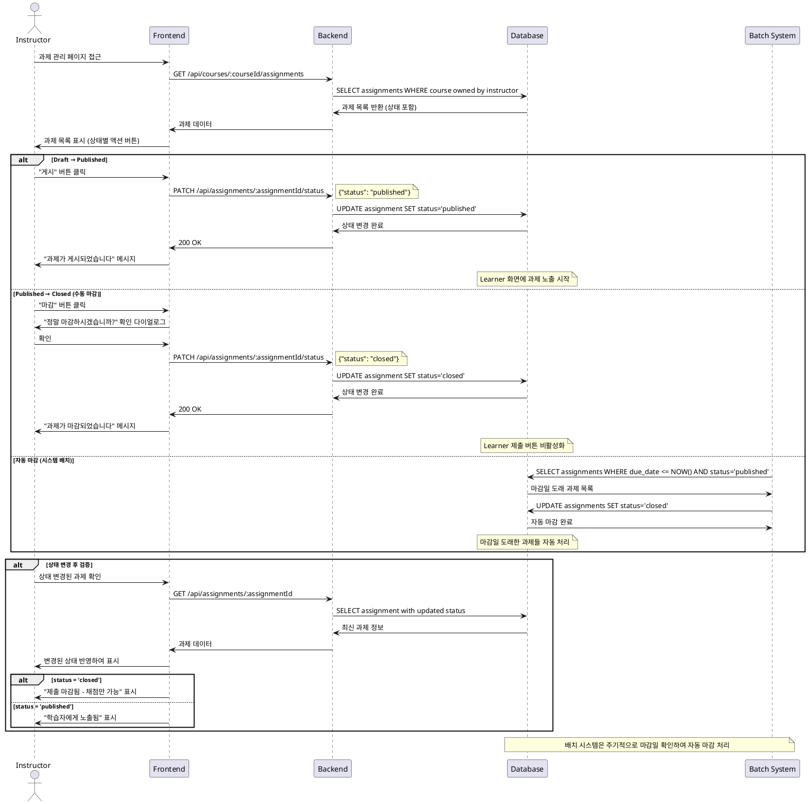

# Use Case 011: Assignment 게시/마감 (Instructor)

## Primary Actor
강사 (Instructor)

## Precondition
- 사용자가 Instructor 역할로 로그인된 상태
- 사용자가 소유한 과제가 존재

## Trigger
강사가 과제 상태를 변경하여 게시하거나 마감 처리

## Main Scenario
1. 강사가 과제 관리 페이지에서 과제 목록을 확인
2. 강사가 상태 변경할 과제를 선택
3. 시스템이 현재 과제 상태 및 가능한 액션을 표시
4. 강사가 상태 변경을 선택:
   - draft → published: 학습자에게 노출 시작
   - published → closed: 제출 마감
   - 수동 마감: 마감일 이전에도 강제 마감 가능
5. 시스템이 상태 변경을 적용
6. 시스템이 학습자 화면에 변경사항을 반영
7. 마감 후에는 채점만 가능한 상태로 전환

## Edge Cases
- **권한 없음**: 다른 강사의 과제 상태 변경 시도 시 403 오류
- **이미 마감된 과제**: closed 상태의 과제를 다시 published로 변경 시도 시 제한
- **제출물 있는 과제**: 제출물이 있는 상태에서 draft로 되돌리기 시도 시 경고
- **자동 마감**: 시스템에서 마감일 도래 시 자동으로 closed 상태로 전환

## Business Rules
- 소유 과제만 상태 변경 가능
- draft 상태에서만 자유로운 수정 가능
- published 상태에서 학습자가 과제를 보고 제출 가능
- closed 상태에서는 제출 불가, 기존 제출물 채점만 가능
- 마감일 도래 시 시스템 배치에 의해 자동 마감
- 수동 마감은 마감일과 관계없이 강사 판단으로 가능

## Sequence Diagram

