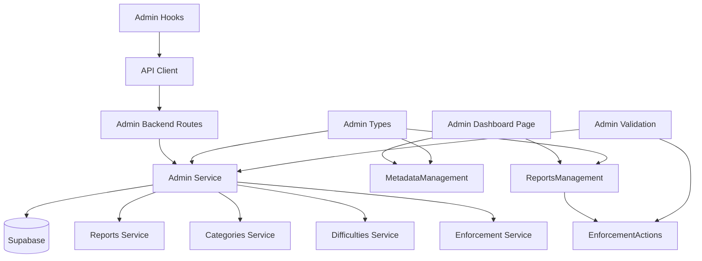

# Use Case 012: 운영 (Operator) - 모듈화 설계

## 개요

### 주요 모듈 목록

| 모듈명 | 위치 | 설명 |
|--------|------|------|
| `admin` | `src/features/admin/` | 운영 기능 전체를 관리하는 feature 모듈 |
| `admin/reports-management` | `src/features/admin/components/reports-management.tsx` | 신고 관리 컴포넌트 |
| `admin/metadata-management` | `src/features/admin/components/metadata-management.tsx` | 메타데이터 관리 컴포넌트 |
| `admin/enforcement-actions` | `src/features/admin/components/enforcement-actions.tsx` | 조치 실행 컴포넌트 |
| `admin-backend` | `src/features/admin/backend/` | 운영 기능 API 및 서비스 로직 |
| `admin-hooks` | `src/features/admin/hooks/` | 운영 기능을 위한 React Query hooks |
| `shared/admin-types` | `src/lib/shared/admin-types.ts` | 운영 기능 관련 공통 타입 정의 |
| `shared/admin-validation` | `src/lib/shared/admin-validation.ts` | 운영 데이터 검증 스키마 |

## Diagram

## Implementation Plan

### 1. Shared Modules (공통 모듈)

#### `src/lib/shared/admin-types.ts`
- **목적**: 운영 기능 관련 공통 타입 정의
- **내용**:
  - `ReportStatus` enum ('received', 'investigating', 'resolved')
  - `Report` 인터페이스 (id, reporterId, targetType, targetId, reason, details, status, createdAt)
  - `EnforcementAction` enum ('warn', 'invalidate', 'restrict', 'dismiss')
  - `EnforcementResult` 인터페이스 (action, targetId, details, executedAt)
  - `MetadataItem` 인터페이스 (id, name, usageCount)
- **단위 테스트**: 타입 정의 검증 및 인터페이스 호환성 테스트

#### `src/lib/shared/admin-validation.ts`
- **목적**: 운영 데이터 검증 스키마 (Zod 사용)
- **내용**:
  - `reportStatusSchema`: 신고 상태 검증
  - `enforcementActionSchema`: 조치 액션 검증
  - `metadataItemSchema`: 메타데이터 항목 검증
- **단위 테스트**: 각 스키마의 유효성 검증 테스트

### 2. Admin Backend Modules

#### `src/features/admin/backend/schema.ts`
- **목적**: 운영 기능 API 요청/응답 스키마 정의
- **내용**:
  - `ReportsResponseSchema`: 신고 목록 응답 스키마
  - `ReportDetailResponseSchema`: 신고 상세 응답 스키마
  - `MetadataResponseSchema`: 메타데이터 응답 스키마
  - `EnforcementRequestSchema`: 조치 요청 검증
- **단위 테스트**: 스키마 검증 및 데이터 변환 테스트

#### `src/features/admin/backend/service.ts`
- **목적**: 운영 기능 비즈니스 로직
- **내용**:
  - `getReports()`: 신고 목록 조회 (필터링 지원)
  - `getReportDetails()`: 신고 상세 정보 조회
  - `updateReportStatus()`: 신고 상태 변경
  - `executeEnforcementAction()`: 조치 실행 (경고/무효화/제한)
  - `getMetadata()`: 메타데이터 목록 조회
  - `createMetadataItem()`: 메타데이터 항목 생성
  - `updateMetadataItem()`: 메타데이터 항목 수정
  - `deleteMetadataItem()`: 메타데이터 항목 삭제 (사용 여부 검증)
  - `validateOperatorAccess()`: Operator 권한 검증
- **단위 테스트**: 운영 로직 및 권한 검증 테스트

#### `src/features/admin/backend/route.ts`
- **목적**: 운영 기능 관련 Hono 라우트 정의
- **내용**:
  - `GET /api/admin/reports`: 신고 목록 조회
  - `GET /api/admin/reports/:reportId`: 신고 상세 조회
  - `PATCH /api/admin/reports/:reportId/status`: 신고 상태 변경
  - `POST /api/admin/reports/:reportId/action`: 조치 실행
  - `GET /api/admin/metadata`: 메타데이터 목록 조회
  - `POST /api/admin/categories`: 카테고리 생성
  - `PUT /api/admin/categories/:id`: 카테고리 수정
  - `DELETE /api/admin/categories/:id`: 카테고리 삭제
  - `POST /api/admin/difficulties`: 난이도 생성
  - `PUT /api/admin/difficulties/:id`: 난이도 수정
  - `DELETE /api/admin/difficulties/:id`: 난이도 삭제
- **QA 시트**: API 엔드포인트 테스트 케이스 (권한 검증, 데이터 검증, 조치 실행)

#### `src/features/admin/backend/error.ts`
- **목적**: 운영 서비스 에러 코드 정의
- **내용**: 권한, 유효성, 조치 관련 에러 코드 및 메시지

### 3. Frontend Components

#### `src/features/admin/components/reports-management.tsx`
- **목적**: 신고 관리 메인 컴포넌트
- **내용**:
  - 신고 목록 테이블 (상태별 필터링)
  - 신고 상세 모달/페이지
  - 상태 변경 액션
  - 조치 실행 컴포넌트 통합
  - 빈 상태 처리 ("처리할 신고가 없습니다")
- **QA 시트**: 신고 관리 UI 테스트 (목록 표시, 필터링, 상태 변경)

#### `src/features/admin/components/metadata-management.tsx`
- **목적**: 메타데이터 관리 컴포넌트
- **내용**:
  - 카테고리/난이도 목록 표시
  - 항목 추가/수정/삭제 폼
  - 사용 중인 항목 표시 및 삭제 제한
  - 변경 확인 다이얼로그
- **QA 시트**: 메타데이터 관리 테스트 (CRUD 작업, 사용 여부 검증)

#### `src/features/admin/components/enforcement-actions.tsx`
- **목적**: 조치 실행 컴포넌트
- **내용**:
  - 조치 옵션 선택 (경고/무효화/제한/기각)
  - 조치 세부 내용 입력
  - 실행 확인 다이얼로그
  - 조치 결과 표시
- **QA 시트**: 조치 실행 테스트 (옵션 선택, 확인 다이얼로그, 결과 처리)

### 4. Frontend Hooks

#### `src/features/admin/hooks/useAdmin.ts`
- **목적**: 운영 기능을 위한 React Query hooks
- **내용**:
  - `useReportsQuery`: 신고 목록 조회
  - `useReportDetailQuery`: 신고 상세 조회
  - `useUpdateReportStatusMutation`: 신고 상태 변경 뮤테이션
  - `useExecuteEnforcementMutation`: 조치 실행 뮤테이션
  - `useMetadataQuery`: 메타데이터 조회
  - `useCreateMetadataMutation`: 메타데이터 생성 뮤테이션
  - `useUpdateMetadataMutation`: 메타데이터 수정 뮤테이션
  - `useDeleteMetadataMutation`: 메타데이터 삭제 뮤테이션
- **단위 테스트**: 뮤테이션 및 쿼리 상태 테스트

### 5. Page Integration

#### `src/app/admin/page.tsx` (신규)
- **목적**: 운영자 대시보드 페이지
- **내용**:
  - ReportsManagement과 MetadataManagement 컴포넌트 통합
  - Operator 권한 검증
- **QA 시트**: E2E 플로우 테스트 (신고 처리, 메타데이터 관리, 권한 검증)

#### `src/app/admin/reports/[reportId]/page.tsx` (신규)
- **목적**: 신고 상세 페이지
- **내용**:
  - 신고 상세 정보 및 EnforcementActions 컴포넌트 통합
- **QA 시트**: E2E 플로우 테스트 (신고 상세 조회, 조치 실행)

### 6. Supporting Backend Dependencies

#### `src/features/reports/backend/service.ts` (신규)
- **목적**: 신고 데이터 관리를 위한 서비스
- **내용**:
  - `getReports()`: 신고 목록 조회
  - `getReportById()`: 신고 상세 조회
  - `updateReportStatus()`: 신고 상태 업데이트
- **단위 테스트**: 신고 데이터 관리 테스트

#### `src/features/enforcement/backend/service.ts` (신규)
- **목적**: 조치 실행을 위한 서비스
- **내용**:
  - `executeWarning()`: 경고 조치 실행
  - `invalidateSubmission()`: 제출물 무효화
  - `restrictAccount()`: 계정 제한
  - `logEnforcementAction()`: 조치 로그 기록
- **단위 테스트**: 조치 실행 및 로깅 테스트

### 구현 순서
1. Shared 모듈 구현 (타입, 검증 스키마)
2. Supporting backend 모듈 구현 (reports, enforcement)
3. Admin backend 모듈 구현 (운영 로직 및 권한 검증)
4. Frontend 컴포넌트 구현 (하위 → 상위)
5. Hooks 및 페이지 통합
6. QA 및 테스트 진행
