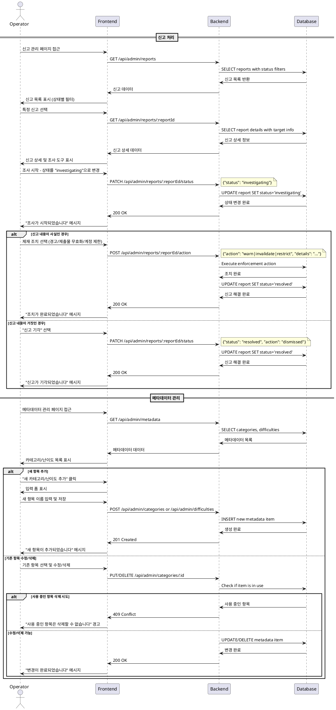

# Use Case 012: 운영 (Operator)

## Primary Actor
운영자 (Operator)

## Precondition
- 사용자가 Operator 역할로 로그인된 상태

## Trigger
운영자가 신고 처리 또는 메타데이터 관리를 위해 운영 페이지에 접근

## Main Scenario
### 신고 처리
1. 운영자가 신고 관리 페이지에 접근
2. 시스템이 신고 목록을 표시 (상태별 필터링 가능)
3. 운영자가 특정 신고를 선택하여 상세 확인
4. 운영자가 조사 상태로 변경하고 조사 시작
5. 운영자가 조사 결과에 따른 액션 수행:
   - 경고 조치
   - 제출물 무효화
   - 계정 제한
6. 운영자가 신고를 해결 상태로 변경

### 메타데이터 관리
1. 운영자가 메타데이터 관리 페이지에 접근
2. 시스템이 카테고리/난이도 목록을 표시
3. 운영자가 새 항목 추가 또는 기존 항목 수정/삭제
4. 시스템이 변경사항을 반영

## Edge Cases
- **권한 없음**: Operator 역할이 아닌 사용자의 운영 페이지 접근 시 403 오류
- **사용 중인 메타데이터 삭제**: 현재 사용 중인 카테고리/난이도 삭제 시도 시 경고
- **중복 신고**: 동일한 대상에 대한 중복 신고 처리
- **삭제된 대상 신고**: 신고 대상이 이미 삭제된 경우 처리 방안

## Business Rules
- Operator 역할만 운영 기능에 접근 가능
- 신고 처리 상태: received → investigating → resolved 순서로 진행
- 사용 중인 메타데이터는 비활성화 처리 권장 (삭제 대신)
- 신고 처리 이력은 모두 보존되어야 함
- 심각한 위반 시 즉시 계정 제한 가능

## Sequence Diagram

